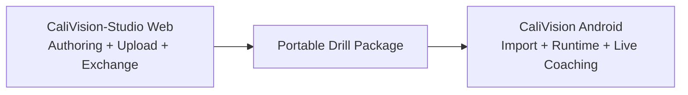

# Architecture Guide

This document is the top-level architecture map for CaliVision Android as the **runtime/live-coaching client** in a two-repo ecosystem.

- Android repo (this): runtime/live coaching/import consumption.
- Studio repo (web): authoring/upload/exchange source of truth.
- Studio link: https://github.com/Voycepeh/CaliVision-Studio

## Product workflow anchors (Android)

- **Home / Live Coaching Hub** (`Route.Home`)
- **Choose Drill (runtime path)** (`Route.Start` -> `Route.Live`)
- **Drill Runtime Detail** (`Route.DrillWorkspace`)
- **Live Session** (`Route.Live`)
- **Results / History** (`Route.Results`, `Route.HistoryOverview`, `Route.SessionHistory`)
- **Import/compatibility surfaces** (drill package import flows)

### Transitional surfaces (present, directionally de-emphasized)

- **Manage Drills** (`Route.ManageDrills`)
- **Drill Studio** (`Route.DrillStudio`)
- **Upload / Reference Training** (`Route.UploadVideo`, `Route.UploadVideoForDrill`)

These remain in code today but are not the long-term primary ownership for Android.

## Runtime layers

1. **UI and navigation**: `app/ui/**`
2. **Workflow orchestration**: live/upload/drill studio view models and route args
3. **Domain**: `drills/**`, `movementprofile/**`
4. **Analysis**: `pose/**`, `motion/**`, `biomechanics/**`
5. **Media/replay/export**: `recording/**`, `media/**`, `camera/**`, `overlay/**`
6. **Persistence**: `storage/db/**`, `storage/repository/**`, `SessionBlobStorage`

## Ecosystem boundary (Studio ↔ Android)

## Portable package boundary map

- `drillpackage/model/*`: Studio↔Android portable contract types and schema/coordinate constants.
- `drillpackage/io/*`: JSON/file package serialization helpers.
- `drillpackage/validation/*`: validation rules and import reports.
- `drillpackage/mapping/*`: portable↔catalog mapping and canonical joint semantics.
- `drillpackage/importing/*`: canonical parse→validate→map import seam for UI callers.

## Key boundaries and contracts

- `SessionRepository` is the persistence boundary for sessions, drills, templates, and media status.
- `SessionMediaResolver` resolves replay source from verified media candidates.
- `AnnotatedExportPipeline` handles annotated replay generation.
- `UploadedVideoAnalyzer` pipeline is executed by `UploadVideoProcessingWorker`; `UploadVideoViewModel` enqueues work and observes repository/DB state.
- Portable package contract and validation define Studio↔Android compatibility (`drillpackage/*`, `DrillPackageValidator`).

## Rules for contributors

- Keep Android positioned as runtime/live-coaching first.
- Preserve package compatibility with Studio as a critical contract.
- Prefer one clear path for drill consumption and in-session outcomes.
- Treat heavy Android-first drill authoring expansion as exceptional and transition-justified only.
- Do not silently break drill metadata/catalog schema.
- Do not silently break replay/export/upload flows.
- Keep naming aligned with current UX terms and ecosystem boundary language.
- Any PR that changes workflows, navigation, architecture, terminology, package behavior, or media flow must update docs and diagrams in the same PR.

## Architecture docs index

- [`docs/architecture/system-overview.md`](docs/architecture/system-overview.md)
- [`docs/architecture/studio-mobile-boundary.md`](docs/architecture/studio-mobile-boundary.md)
- [`docs/architecture/package-import-runtime-flow.md`](docs/architecture/package-import-runtime-flow.md)
- [`docs/architecture/app-modules.md`](docs/architecture/app-modules.md)
- [`docs/architecture/session-lifecycle.md`](docs/architecture/session-lifecycle.md)
- [`docs/architecture/video-pipeline.md`](docs/architecture/video-pipeline.md)
- [`docs/architecture/replay-and-fallback.md`](docs/architecture/replay-and-fallback.md)
- [`docs/architecture/overlay-rendering.md`](docs/architecture/overlay-rendering.md)
- [`docs/architecture/movement-profile-architecture.md`](docs/architecture/movement-profile-architecture.md)

## Diagram index

- [`docs/diagrams/ui-flow.md`](docs/diagrams/ui-flow.md)
- [`docs/diagrams/architecture-subsystems.md`](docs/diagrams/architecture-subsystems.md)
- [`docs/diagrams/sequence-live-session.md`](docs/diagrams/sequence-live-session.md)
- [`docs/diagrams/sequence-import-analysis.md`](docs/diagrams/sequence-import-analysis.md)
- [`docs/diagrams/sequence-export-finalization.md`](docs/diagrams/sequence-export-finalization.md)
- [`docs/diagrams/class-diagram.md`](docs/diagrams/class-diagram.md)
