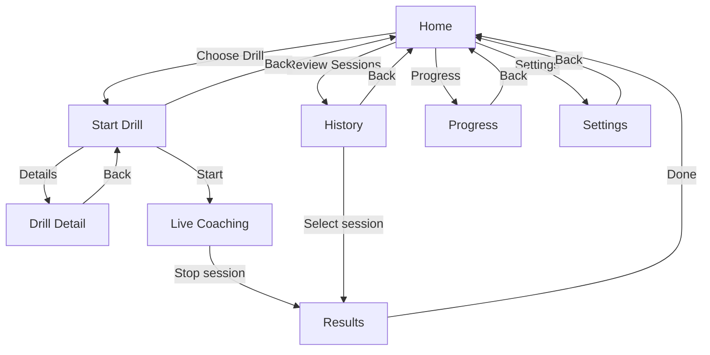

# Inversion Coach (Android)

Inversion Coach is an Android app that provides real-time feedback for handstand and handstand-push training. It uses on-device pose tracking to analyze movement quality, identify common form issues, and coach athletes through reps and holds.

## What the app does

- Guides users through handstand-focused drills (beginner to intermediate).
- Uses the camera to estimate body landmarks in real time.
- Translates landmarks into movement phases (for example: start, bottom, top).
- Detects posture faults and delivers simple live cues.
- Summarizes the session with rep and quality insights.

Current drill library includes:
- Free Standing Handstand
- Wall Assisted Handstand
- Pike Push-Up
- Elevated Pike Push-Up
- Free Standing Handstand Push-Up
- Wall Assisted Handstand Push-Up

## High-level architecture

```text
Camera input
-> Pose landmarks (ML Kit)
-> Temporal smoothing
-> Angle + posture signal extraction
-> Movement phase detection
-> Fault detection (persistence-based)
-> Cue selection and live coaching
-> Session summary + history storage
```

### Main subsystems

- **Motion Analysis Pipeline**: Converts camera-derived pose data into stable movement and posture signals.
- **Coaching Engine**: Chooses the most relevant cue at the right time (cooldown + priority).
- **Drill Catalog**: Defines each drill's phases, posture expectations, and cue library.
- **Live UI**: Displays camera feed, overlays, and coaching status while a drill is active.
- **Session Tracking**: Stores completed sessions for history and progress views.

## Page layout architecture



## Install from Releases (recommended)

1. Go to the repository's **Releases** page on GitHub.
2. Download the latest `app-release.apk` (or similarly named APK asset).
3. On your Android device, allow installs from unknown sources for the browser/file manager you used.
4. Open the downloaded APK and complete installation.
5. Launch **Inversion Coach** and grant camera permission.

> Tip: If Android blocks installation, re-download the APK and confirm it came from the official repository release assets.

## Optional: Build locally

If you prefer to build yourself instead of installing from Releases:

- Android Studio (latest stable)
- Android SDK 34
- JDK 17
- Gradle 8.14+

Open the project in Android Studio, sync, then run the `app` configuration on a physical Android device.

## Quality-based coaching layer (new)

The coaching stack now adds a dedicated quality layer on top of camera → pose → biomechanics → cues:

- **Alignment score (0–100)** with drill-specific weighting, raw + smoothed score, and dominant limiting fault.
- **Strictness profiles**: Beginner, Standard, Advanced, and Custom calibration for line deviation + quality thresholds.
- **Hold quality timer** for handstand holds:
  - total hold duration
  - aligned hold duration
  - alignment rate
  - best aligned streak
  - average alignment score
- **Rep quality scoring** for push-up variants:
  - per-rep quality score
  - acceptance/rejection gate
  - rep fault tags
  - failure reason summary
- **Balance stability metric** for inversion drills:
  - centerline deviation
  - sway amplitude
  - sway frequency
  - stability score (0–100)

All quality metrics are surfaced live in session UI and persisted into session summaries/history for post-session review.

## Biomechanics threshold model

The biomechanics scoring layer now uses **banded, drill-aware thresholds** instead of single-point targets and opaque proxy multipliers.

- **Torso-normalized where relevant**: stack and line metrics remain normalized by torso length.
- **Drill-specific bands**: handstand and rep-drill families use dedicated threshold profiles.
- **Phase-aware rep scoring**: rep drills score descent quality, bottom depth quality, ascent quality, top lockout quality, and flare/stability quality.
- **Strictness presets**: Beginner / Standard / Advanced shift threshold bands (approximately ±5° for angle bands and ±0.02 for stack tolerances).
- **Biomechanics-informed ranges**: thresholds are based on practical coaching ranges and are not presented as lab-grade measurement claims.

### Current key bands

- Handstand (chest-to-wall + freestanding):
  - Elbow and knee: excellent ≥175, acceptable 165–174, soft 155–164, poor <155.
  - Shoulder openness: excellent 175–185, acceptable 165–174, limited 155–164, poor <155.
  - Hip line: excellent 170–180, acceptable 160–169, poor <160.
  - Stack deviation (torso-normalized): excellent ≤0.06, acceptable ≤0.12, poor >0.12.
- Push-up family:
  - Top lockout: valid ≥170, warning 160–169, incomplete <160.
  - Bottom depth: elbow full-depth 80–100, shallow warning >100, collapse warning <75.
