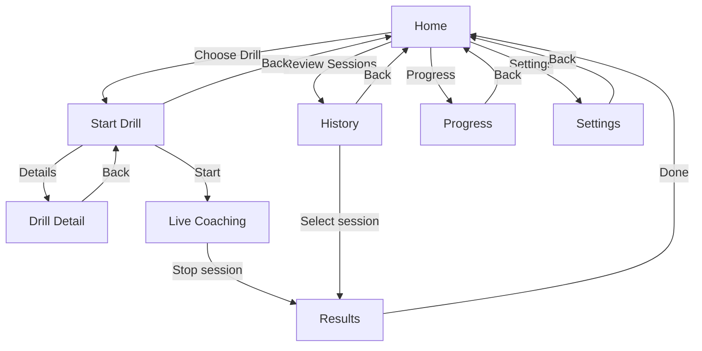
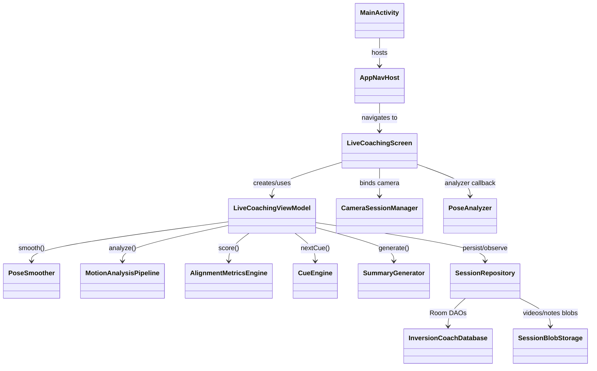
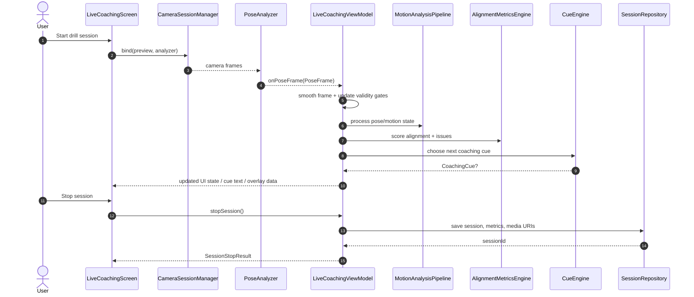

# Inversion Coach (Android)

Inversion Coach is a Kotlin/Jetpack Compose Android app for handstand-oriented live coaching. It runs on-device pose detection, derives movement/quality signals, provides timed coaching cues, and stores sessions for history/progress review.

## High-level: what this app is and how people use it

### What this app is about

Inversion Coach helps athletes improve inversion technique (handstands and handstand push-up variations) with **real-time feedback** from on-device pose tracking. The app focuses on practical coaching: detect movement quality issues early, surface simple actionable cues, and summarize how the session went.

### How users should use it

1. Pick a drill (or freestyle mode) from Home.
2. Position camera so full body is visible.
3. Run the set while the app tracks pose and gives live cues.
4. Stop the session and review scores/issues in Results.
5. Use History/Progress to track changes over time.

### Main solution flow (high level)

```text
Select drill -> Start live session -> Camera + pose tracking ->
Motion/quality analysis -> Coaching cue output -> Session persistence ->
Results + History + Progress review
```

## Project overview

### What the app does today

- Runs real-time camera + pose analysis for inversion drills.
- Supports freestyle and drill-guided flows (holds and rep-based patterns).
- Surfaces live guidance (visual overlays, cue text, optional voice cues).
- Records and stores session outputs (session metrics, optional videos, issue timelines).
- Provides history, results, and progress screens backed by local persistence.

### Main user flow

1. User opens **Home** and starts a drill or freestyle session.
2. **Live Coaching** initializes camera + analyzer pipeline.
3. Pose frames are smoothed and passed through motion/biomechanics scoring.
4. Cue engine emits actionable coaching prompts.
5. User stops session; app persists summary + media and opens **Results**.
6. Session can later be reviewed via **History** and **Progress**.

### UI navigation flow



## Current architecture

### Runtime layers

- **App entry + navigation**
  - `MainActivity` hosts Compose app navigation via `AppNavHost`.
- **UI layer (Compose)**
  - Screens under `ui/` drive user flows (`home`, `startdrill`, `live`, `results`, `history`, `progress`, `settings`).
- **Capture + pose layer**
  - `CameraSessionManager` binds CameraX preview/video/analyzer.
  - `PoseAnalyzer` converts camera frames to normalized `PoseFrame`.
- **Analysis/domain layer**
  - `MotionAnalysisPipeline` + `AlignmentMetricsEngine` produce motion phases, quality metrics, and drill scoring.
  - `CueEngine` generates coaching cue timing/text.
  - `SummaryGenerator` composes result summaries/recommendations.
- **Data layer**
  - `SessionRepository` coordinates Room DAOs + blob storage (`SessionBlobStorage`).
  - `InversionCoachDatabase` stores sessions/settings/frame metrics.

### Data movement (high level)

`CameraX frame -> PoseAnalyzer -> LiveCoachingViewModel -> Motion/Biomechanics/Cue engines -> UI state + repository persistence -> Results/History/Progress screens`

## Architecture

### Class diagram (UML / Mermaid)



### Sequence diagram (UML / Mermaid)




## Annotated export pipeline (updated)

- Live preview overlays are still rendered on top of CameraX preview.
- Recording and export are separate stages:
  1. capture + finalize raw camera replay (`raw.mp4`)
  2. post-process raw video with saved overlay frames into `annotated.mp4`
- Recorded source media always remains a **raw** camera file first.
- Annotated replay is a deterministic post-processing pipeline (not screen recording / MediaProjection).
- On finalize, the app runs a compositor that decodes raw frames, redraws overlays from timestamped pose data, and re-encodes a true annotated MP4.
- Exported `annotated.mp4` includes:
  - skeleton / limb lines
  - head and hip dots
  - ideal vertical alignment line
  - drill-aware overlay geometry (camera-side and orientation logic)
- Replay selection prefers annotated asset when available and readable.
- Raw replay remains the fallback whenever annotated export fails.

Debug builds also perform a lightweight validation pass that compares raw vs annotated frames to verify the overlay appears in the generated file.

## Repository structure

- `app/src/main/java/com/inversioncoach/app/`
  - `ui/`: Compose screens, navigation, and presentation helpers.
  - `camera/`: CameraX session binding/orchestration.
  - `pose/`: ML Kit pose analysis and frame shaping.
  - `motion/`: phase detection, quality/fault evaluation, drill catalog.
  - `biomechanics/`: drill scoring/threshold engines and analyzer support.
  - `coaching/`: cue + voice coaching logic.
  - `storage/`: repository, Room database/DAOs, blob storage.
  - `recording/`: recording and annotated export pipeline.
- `app/src/main/res/`: Android resources (icons, strings, drawables, XML configs).
- `app/src/test/`: JVM unit tests for motion/overlay/logic subsystems.
- `docs/`: supplementary design and migration notes.
- `scripts/`: utility scripts (e.g., release APK download helper).

## Setup and build

### Prerequisites

- Android Studio (current stable) or local Gradle CLI.
- Android SDK 34 installed.
- JDK 17.
- Android device/emulator API 28+ with camera support for live coaching flows.

> Note: this repo currently does **not** include `gradlew`; use a local `gradle` install.

### Build locally (CLI)

```bash
gradle :app:assembleDebug
gradle :app:testDebugUnitTest
```

### Install debug APK to device

```bash
gradle :app:installDebug
```

Then launch **Inversion Coach** and grant camera permission.

### Release build

Release signing is read from Gradle properties (`~/.gradle/gradle.properties` or `-P` flags):

- `RELEASE_STORE_FILE`
- `RELEASE_STORE_PASSWORD`
- `RELEASE_KEY_ALIAS`
- `RELEASE_KEY_PASSWORD`
- optional: `APP_VERSION_CODE`, `APP_VERSION_NAME`

If release signing props are missing, local release builds fall back to debug keystore signing.

```bash
gradle :app:assembleRelease
```

### Install from GitHub Releases (if using published APKs)

1. Download latest APK asset from Releases.
2. Allow installs from unknown sources for your installer app.
3. Install APK and launch app.
4. Grant camera permission when prompted.
