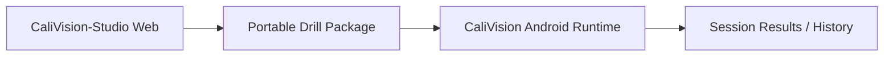
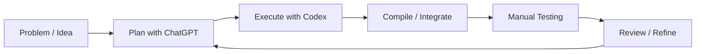

# CaliVision Android

**Mobile live-coaching runtime for the CaliVision ecosystem.**

CaliVision Android is the edge-device companion to **CaliVision-Studio (web)**: Android handles in-session coaching execution, while Studio handles authoring and upload-driven analysis.

👉 Studio repo: **https://github.com/Voycepeh/CaliVision-Studio**

## Why I built CaliVision

I built CaliVision because I wanted help visualizing my handstand stack.
I was already recording and replaying videos manually. I wanted structured feedback fast enough to adjust in the next set.

I also come from a data architecture / BI background rather than traditional app development, so CaliVision has become a practical human-led, AI-assisted software development experiment.

## Product direction

The product direction is intentional and explicit:

- **Android (this repo):** live coaching runtime on device, portable in-session UX, session review/history, and consumption of Studio-authored portable drill packages.
- **Studio web:** upload video analysis, drill authoring/drill management, package publishing/exchange, and heavier editing workflows.

This split is not a missing feature or regression. It is the long-term product shape.

## A short history

CaliVision started as a broader Android experiment that combined live coaching, uploaded-video analysis, and mobile drill authoring in one app. That helped validate ideas quickly, but ownership became blurry and UX became less coherent.

The cleaner model is now:

- edge-device runtime on Android
- web authoring/upload workflows in Studio

Android is being simplified toward in-session coaching.

## What Android is responsible for now

- Real-time, in-session live coaching execution
- Camera-first runtime feedback loops
- Importing and consuming Studio-authored portable drill packages
- Session replay, results, and history on device
- Lightweight runtime drill usage flows needed for training continuity

## What Studio is responsible for now

- Upload video analysis workflows
- Drill Studio authoring and drill management (source of truth)
- Package publishing and exchange workflows
- Heavier browser-first editing and lifecycle management

## Why mobile still matters

Phones are still the best runtime surface for coaching sessions:

- instant camera access at the training location
- low setup friction between sets
- portability across gym, park, and home contexts
- direct feedback loops without switching to desktop

## Ecosystem relationship diagram



## Human-led, AI-assisted build workflow



Workflow notes:

- ChatGPT is used for planning, framing tradeoffs, and review support.
- Codex is used for scoped implementation tasks.
- The human owner remains the decision-maker, integrator/compiler, and tester.

## Repo scope guardrail

This Android repo is not the long-term primary surface for upload analysis or full drill authoring. Those workflows belong to Studio web and should be described that way in docs and product decisions.

## Development setup

Prerequisites:

- JDK 17
- Android SDK 34 (compileSdk/targetSdk 34)
- `gradle` on PATH (Gradle wrapper is not checked in)

Main validation commands:

```bash
gradle testDebugUnitTest
gradle :app:assembleDebug
```

## Additional documentation

- Top-level architecture: [`ARCHITECTURE.md`](ARCHITECTURE.md)
- Docs index: [`docs/README.md`](docs/README.md)
- Studio/mobile boundary: [`docs/architecture/studio-mobile-boundary.md`](docs/architecture/studio-mobile-boundary.md)
- Package import runtime flow: [`docs/architecture/package-import-runtime-flow.md`](docs/architecture/package-import-runtime-flow.md)
- Drill package contract: [`docs/drill-package-contract.md`](docs/drill-package-contract.md)
