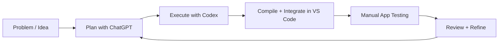
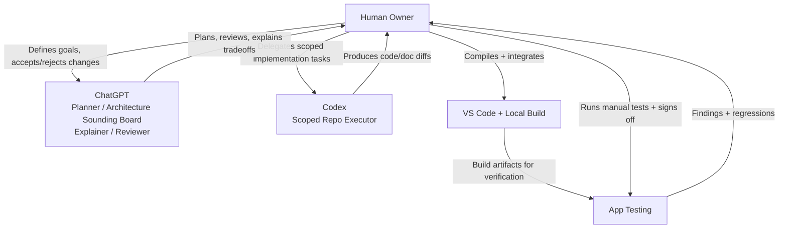
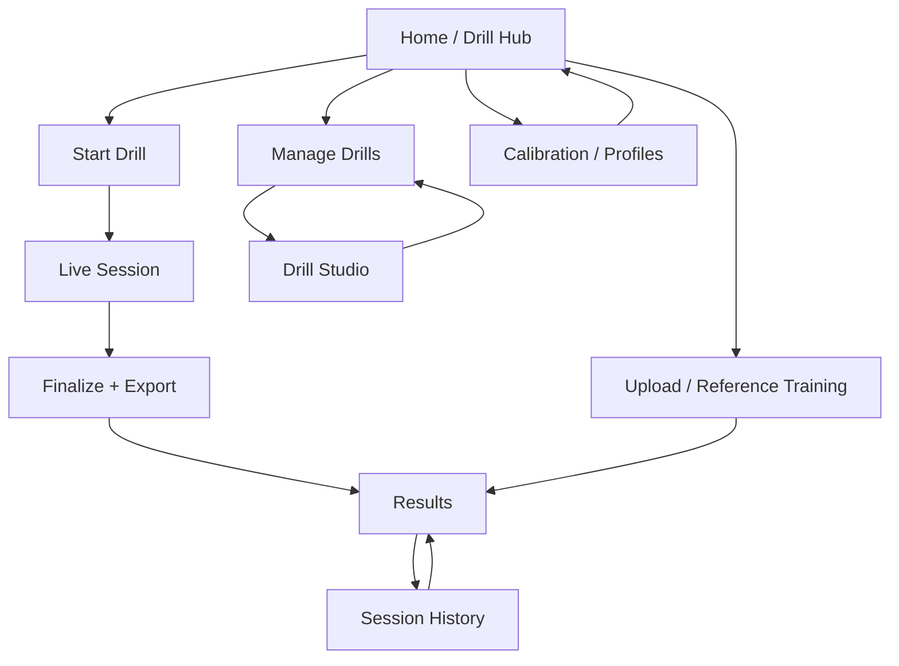
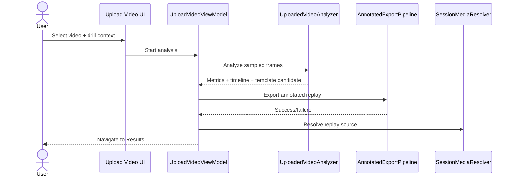

# CaliVision

CaliVision is a drill-centric Android training app for calisthenics practice. It connects live coaching, upload analysis, drill authoring, replay review, and calibration/profile context in one workflow.

## Why I built CaliVision

I built CaliVision because my own movement practice felt too unstructured when it depended on recording videos and replaying them manually. I wanted a tighter loop: practice with intention, compare against references, and get structured feedback quickly enough to adjust in the next set—not hours later.

The goal is simple: shorten the feedback cycle for calisthenics and handstand training through analysis, comparison, and drill-centered review. CaliVision is also an active experiment in practical AI-assisted software development, where AI helps accelerate the work but does not replace human judgment.

## How this project is built

This project uses a human-led, AI-assisted workflow:

- **ChatGPT** is used as a planning and architecture partner: clarifying requirements, pressure-testing design choices, explaining tradeoffs, and reviewing proposed changes.
- **Codex** is used as an execution partner: implementing scoped repository changes, updating docs, and preparing PR-ready diffs.
- **Human owner (me)** remains the decision-maker: selecting direction, compiling/integrating in VS Code, validating behavior, and manually testing the app on real workflows.

Short version for skimmers: **ChatGPT helps plan, Codex helps implement, and I approve + validate everything before it ships.**



## Human-in-the-loop SDLC

This is intentionally **not** fully autonomous software development. AI contributes speed, structure, and implementation support, while human oversight controls quality and product direction.



## What the app does

CaliVision keeps users in drill context from start to review:

- **Home / Drill Hub**: launch point for practice and navigation.
- **Manage Drills**: maintain drill catalog entries.
- **Drill Studio**: create/edit drill definitions and templates.
- **Live Session**: countdown-gated real-time coaching with overlays.
- **Upload / Reference Training**: analyze imported clips and optionally produce drill-linked references.
- **Results / Session History**: inspect outcomes and replay assets.
- **Calibration / Profiles**: manage active body profile inputs used by analysis.

## Core workflows





Detailed diagrams live in [`docs/diagrams/`](docs/diagrams).

## Tech stack

- Kotlin + Jetpack Compose
- AndroidX Navigation + ViewModel state flows
- Room database + blob/media storage
- ML Kit pose detection
- On-device motion/biomechanics scoring modules
- WorkManager-backed upload queue processing

## How the system works

1. UI routes in `ui/navigation/Nav.kt` coordinate screen transitions.
2. Workflow view models (`ui/live`, `ui/upload`, `ui/drillstudio`) orchestrate user flows.
3. Domain modules (`drills`, `movementprofile`, `calibration`) provide drill and profile behavior.
4. Analysis modules (`pose`, `motion`, `biomechanics`) score and classify movement.
5. Recording/export modules (`recording`, `media`) generate replay outputs with fallback.
6. `storage/repository/SessionRepository` persists sessions, drill metadata, media status, and references.

## Project structure / docs map

- Top-level architecture: [`ARCHITECTURE.md`](ARCHITECTURE.md)
- Contribution guide: [`CONTRIBUTING.md`](CONTRIBUTING.md)
- Testing guide: [`TESTING.md`](TESTING.md)
- Docs index: [`docs/README.md`](docs/README.md)
- Architecture deep dives: [`docs/architecture/`](docs/architecture)
- Feature behavior: [`docs/features/`](docs/features)
- Decision records: [`docs/decisions/`](docs/decisions)
- Diagrams: [`docs/diagrams/`](docs/diagrams)

## Running locally

Prerequisites:

- JDK 17
- Android SDK 34 (compileSdk/targetSdk 34)
- `gradle` available on PATH (the Gradle wrapper is not checked in)

Commands:

```bash
gradle testDebugUnitTest
gradle :app:assembleDebug
```

## Documentation

If you change workflow names, routes, navigation behavior, architecture boundaries, replay/export/media behavior, upload/reference behavior, or calibration/profile behavior, **update docs and diagrams in the same PR**.

Start here:

- [`docs/features/current-user-flows.md`](docs/features/current-user-flows.md)
- [`docs/architecture/system-overview.md`](docs/architecture/system-overview.md)
- [`docs/diagrams/ui-flow.md`](docs/diagrams/ui-flow.md)

## Screenshots / media assets

No screenshots are currently checked in.

Expected README asset placeholders:

- `docs/assets/home-drill-hub.png`
- `docs/assets/live-session.png`
- `docs/assets/upload-reference-training.png`
- `docs/assets/results-session-history.png`

When assets are added, keep them optimized and update this section.
