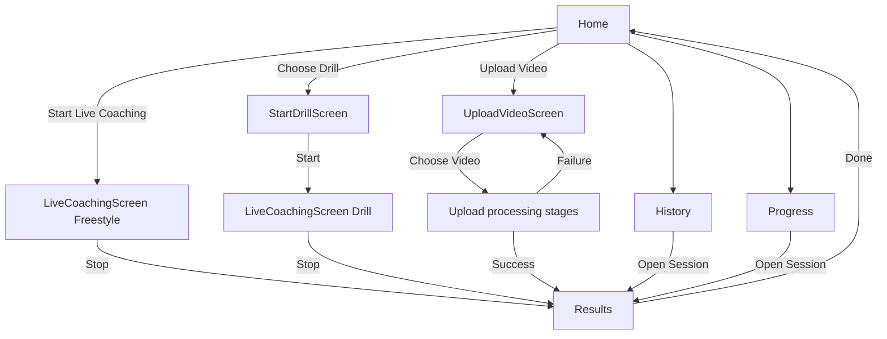
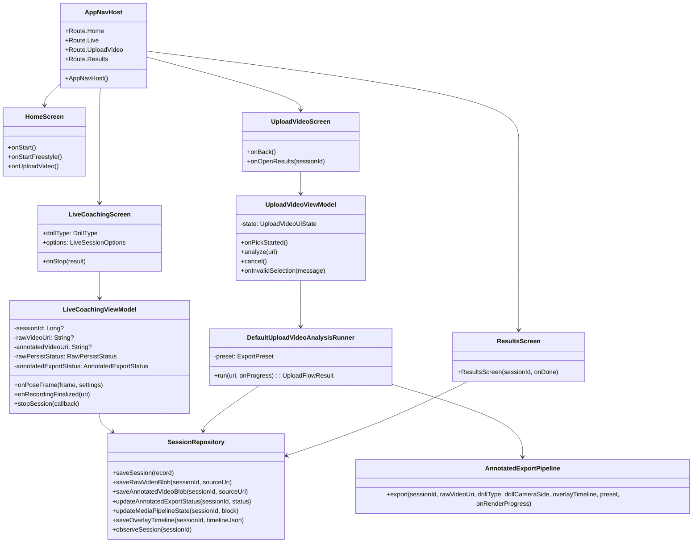
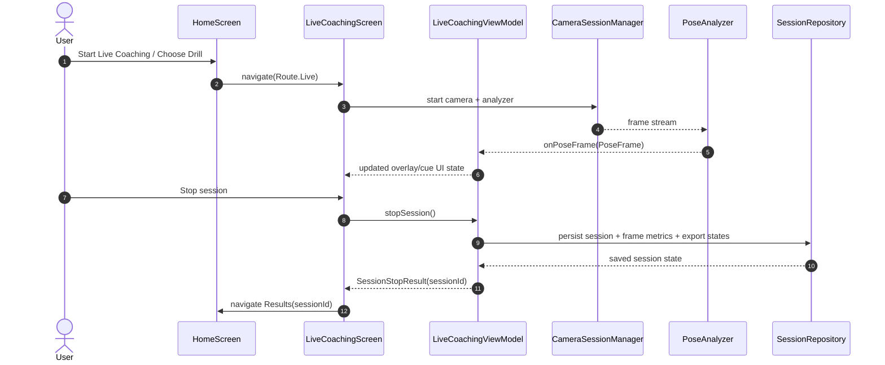
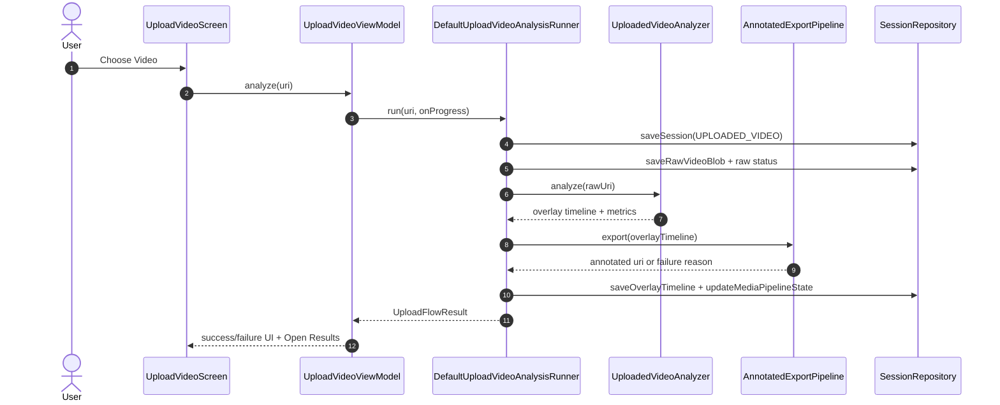
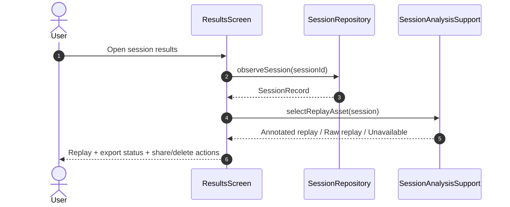

# Inversion Coach (Android)

Inversion Coach is a Kotlin/Jetpack Compose Android app with two primary video features:

1. **Live coaching overlay** (camera + real-time analysis)
2. **Upload-video overlay analysis** (offline analysis of imported clips)

Both flows persist sessions and converge on a shared **Results / Replay / Export fallback** experience.


## Local setup (build-accurate)

### Prerequisites

- **JDK 17** (required).
- Android SDK with:
  - `compileSdk 34`
  - `targetSdk 34`
  - `minSdk 28`
- Android Studio (recommended) or Gradle 8.14.x CLI.

### Quick start

1. Ensure Java 17 is active:
   ```bash
   export JAVA_HOME=/path/to/jdk-17
   export PATH="$JAVA_HOME/bin:$PATH"
   java -version
   ```
2. Run unit tests:
   ```bash
   gradle testDebugUnitTest
   ```
3. Build debug APK:
   ```bash
   gradle :app:assembleDebug
   ```

### Notes

- This repository does **not** include a checked-in `gradlew` wrapper script right now, so commands above use your locally installed `gradle`.
- For release signing, provide `RELEASE_STORE_FILE`, `RELEASE_STORE_PASSWORD`, `RELEASE_KEY_ALIAS`, and `RELEASE_KEY_PASSWORD` Gradle properties.

---

## Current feature overview

### 1) Live coaching overlay flow (real-time)

- Entry points from **Home**:
  - **Start Live Coaching** (freestyle)
  - **Choose Drill** (drill-specific session)
- `LiveCoachingScreen` wires camera lifecycle to `LiveCoachingViewModel`.
- Pose frames are analyzed in real-time and rendered as overlay during the session.
- On stop, session finalization persists:
  - summary + metrics
  - frame metrics / issue timeline
  - raw recording status + URI
  - annotated export status and replay asset selection
- Replay resolution prefers annotated output when truly ready, otherwise raw fallback.

### 2) Upload-video overlay analysis flow (offline)

- Entry point from **Home**: **Upload Video**.
- `UploadVideoScreen` -> `UploadVideoViewModel` -> `DefaultUploadVideoAnalysisRunner`.
- Pipeline:
  1. import raw video blob
  2. run offline pose analysis (`UploadedVideoAnalyzer`)
  3. synthesize overlay timeline
  4. run annotated export pipeline
  5. verify and persist replay-selectable asset
- UI states are stage-based: preparing, analyzing, rendering, verifying, success/failure.
- If annotated export fails, flow still preserves truthful fallback to raw replay.

### 3) Replay / export / session flow

- **Results** screen uses replay selection helpers to choose the best readable asset.
- Export status is reflected from persisted session state (`AnnotatedExportStatus`, raw persist state).
- History and Progress route back to Results for replay and session review.

---

## Real architecture (implementation-aligned)

### App modules used today

- **Navigation/UI**: `ui/navigation/Nav.kt`, screen packages under `ui/`
- **Live session pipeline**:
  - `ui/live/LiveCoachingScreen.kt`
  - `ui/live/LiveCoachingViewModel.kt`
  - `camera/CameraSessionManager.kt`
  - `pose/PoseAnalyzer.kt`, `pose/PoseSmoother.kt`
  - `motion/*`, `biomechanics/*`, `coaching/*`
- **Upload pipeline**:
  - `ui/upload/UploadVideoFlow.kt`
  - `movementprofile/UploadedVideoAnalyzer.kt`
  - `movementprofile/MlKitVideoPoseFrameSource.kt`
  - `recording/AnnotatedExportPipeline.kt`
- **Persistence & media**:
  - `storage/repository/SessionRepository.kt`
  - Room entities/DAOs under `storage/db/*`
  - blob/media helpers (`SessionBlobStorage`, recording helpers)
- **Replay/export state interpretation**:
  - `ui/live/SessionAnalysisSupport.kt`
  - `ui/results/ResultsScreen.kt`

### Boundary separation

- **Live coaching** is driven by camera-time pose callbacks and live state machine in `LiveCoachingViewModel`.
- **Upload analysis** is driven by `UploadVideoViewModel` + `DefaultUploadVideoAnalysisRunner` and does not depend on live camera session state.
- Shared pieces (repository, export pipeline, replay selectors) are reused where they are genuinely cross-flow.

---

## UI/user flowchart (current)



---

## UML diagrams (current code)

### Class diagram (core services/viewmodels/pipelines)



### Sequence diagram: live overlay flow



### Sequence diagram: upload-video overlay flow



### Sequence diagram: replay/export finalization



---

## Notes on removed/outdated assumptions

- Upload analysis now reports truthful success when annotated export is unavailable and falls back to raw replay.
- Replay selection is status + asset readability based (not hardcoded success messaging).
- Live flow keeps camera-time overlay path as source-of-truth for live coaching, with persisted replay path resolved at finalization.

---

## Repository structure

- `app/src/main/java/com/inversioncoach/app/`
  - `ui/`: Compose screens + navigation + presentation helpers
  - `camera/`: CameraX session manager
  - `pose/`: pose frame extraction and smoothing
  - `motion/`: movement phase/quality engines
  - `biomechanics/`: drill-specific metrics and scoring
  - `movementprofile/`: upload/offline analysis profile + analyzer pieces
  - `recording/`: overlay timeline and annotated export pipeline
  - `storage/`: repository, Room DB/DAOs, blob storage
- `app/src/test/`: JVM unit tests
- `docs/`: design notes and migration docs

## Build/test locally

> This repository currently uses local `gradle` CLI (no `gradlew` wrapper checked in).

```bash
gradle :app:assembleDebug
gradle :app:testDebugUnitTest
```
