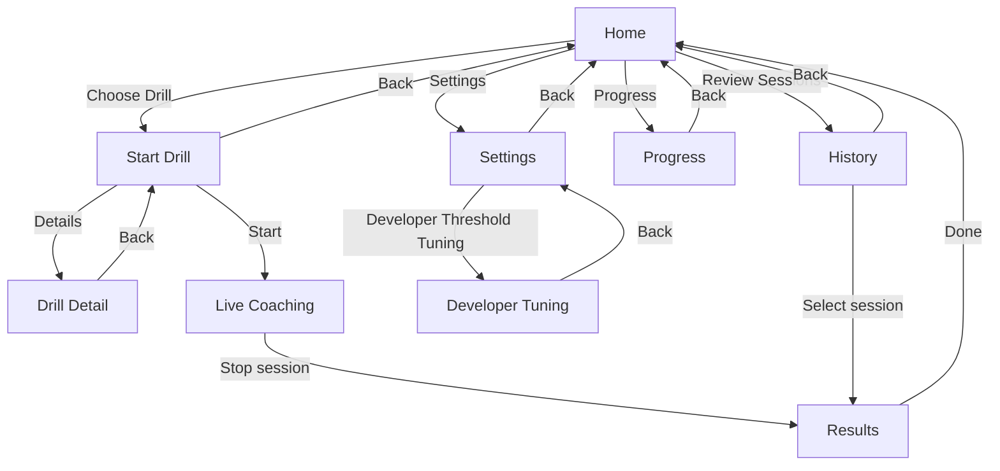

# Inversion Coach (Android)

Inversion Coach is an Android app for calisthenics and posture coaching.

## Architecture (motion-aware)

```text
CAMERA FRAME
-> pose detection landmarks (ML Kit)
-> temporal smoothing (EMA + confidence weighting)
-> joint angle calculations
-> movement phase detection (FSM)
-> posture fault detection (persistence gated)
-> live cue generation (cooldown + priority)
-> session rep summary
```

Core code paths:
- Camera + ML inference: `pose/PoseAnalyzer.kt`
- Legacy smoothing + biomech scoring path: `pose/PoseSmoother.kt`, `biomechanics/*`
- New motion analysis pipeline: `motion/*`
- Live UI integration: `ui/live/*`
- Drill selection + preview animation: `ui/startdrill/*`, `ui/components/DrillPreviewAnimation.kt`

## Motion pipeline modules

New reusable modules under `app/src/main/java/com/inversioncoach/app/motion`:
- `PoseFrame`: timestamp + landmarks + per-landmark confidence
- `SmoothedPoseFrame`: filtered landmarks + per-joint velocity
- `AngleFrame`: named angles, trunk lean, pelvic tilt proxy, line deviation
- `MovementState`: phase, progress, confidence, start time, rep count
- `FaultEvent`: code, severity, message, side, start/end
- `TemporalPoseSmoother`: EMA smoothing with confidence weighting and missing-joint fallback
- `AngleEngine`: 2D angle calculations (extensible for future 3D)
- `MovementPhaseDetector`: FSM with hysteresis via dwell time
- `FaultDetectionEngine`: persistence-gated fault rules
- `FeedbackEngine`: one-cue-at-a-time, cooldown-based cueing
- `MotionAnalysisPipeline`: end-to-end orchestrator

## Drill metadata system

`DrillCatalog.kt` defines drill metadata using Kotlin data classes (JSON-like shape):
- id, displayName, category, level, equipment, movementPattern
- primaryJoints, trackedAngles, requiredLandmarks
- phaseModel, postureRules, cueLibrary
- thumbnail/animation refs
- repCountingEnabled, holdModeEnabled
- checkpoints and keyframe animation source

The catalog includes **15 drills** (including beginner drills).

## Drill preview animation system

- Previews are procedural 2D dummy animations.
- Source of truth: keyframes (`DrillPreviewKeyframe`) in `DrillCatalog.kt`.
- Runtime interpolation and rendering on Compose `Canvas` in `DrillPreviewAnimation.kt`.
- No external copyrighted videos are used.

## Drill selection UX

Start Drill screen now includes:
- looping preview animation per drill
- level tag + movement pattern tag
- tracked checkpoints summary
- details button that opens a drill detail screen with posture checklist

## App page map (navigation flow)

Current app navigation pages and routes:
- `Home` (`home`)
- `Start Drill` (`start`)
- `Drill Detail` (`drillDetail/{drill}`)
- `Live Coaching` (`live/{drill}/{voice}/{record}/{skeleton}/{idealLine}/{zoomOutCamera}`)
- `Results` (`results/{sessionId}`)
- `History` (`history`)
- `Progress` (`progress`)
- `Settings` (`settings`)
- `Developer Tuning` (`settings/dev-tuning`)



## Debug / tuning tools

- Live debug overlay now includes current phase, active fault, and rep count.
- Settings includes navigation to **Developer threshold tuning** screen.
- Developer screen supports live threshold tuning for key posture/fault limits.

## How to add a new drill

1. Add/confirm the app drill enum (`model/Models.kt`) for runtime routing.
2. Add drill metadata in `motion/DrillCatalog.kt` using `def(...)`.
3. Add an animation spec (`symmetricSpec`, `lungeSpec`, or a new custom spec).
4. Define phases, faults, cues, movement pattern, and rep mode.
5. Add future rule placeholders for expected analysis strategy.
6. Wire analyzer thresholds in the motion pipeline when posture detection is added for that drill.

## Defining joints and keyframes

- Use normalized coordinates (`0f..1f`) in `NormalizedPoint`
- Include key poses when applicable:
  - neutral
  - start
  - mid eccentric
  - bottom
  - mid concentric
  - top
  - optional hold
- Keep first/last poses compatible for smooth loops

## Mirroring rules

- Enable `mirroredSupported = true` on `SkeletonAnimationSpec`
- Renderer can request mirrored playback
- Engine swaps left/right joint keys and flips x-axis (`x -> 1 - x`)

## Tests

Unit tests cover:
- keyframe interpolation
- mirroring
- loop continuity
- animation loading
- drill schema field integrity

## Build

Use local Gradle installation if wrapper is missing:

```bash
gradle :app:testDebugUnitTest
gradle :app:assembleDebug
```
