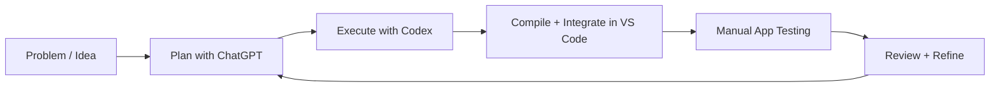
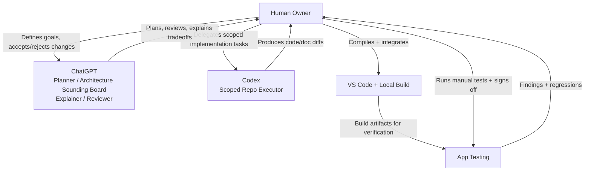
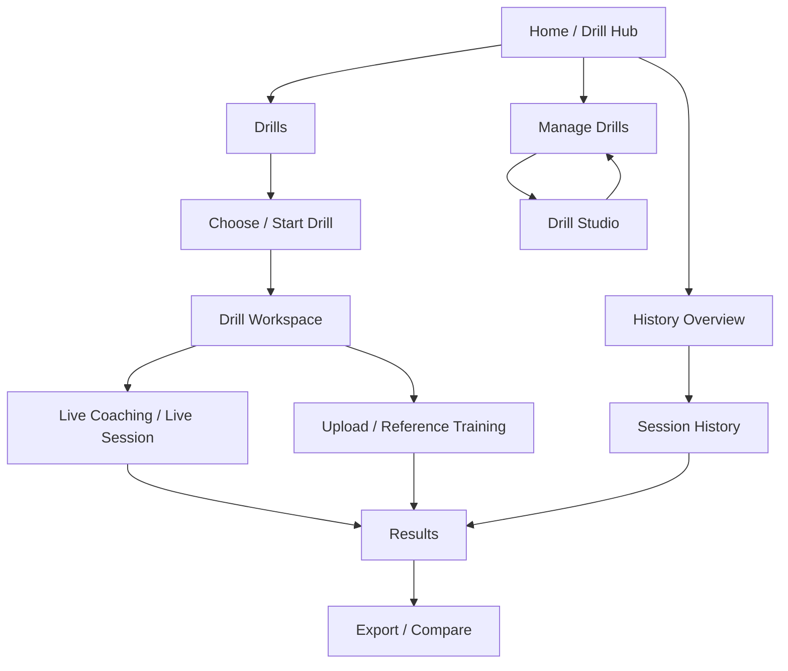
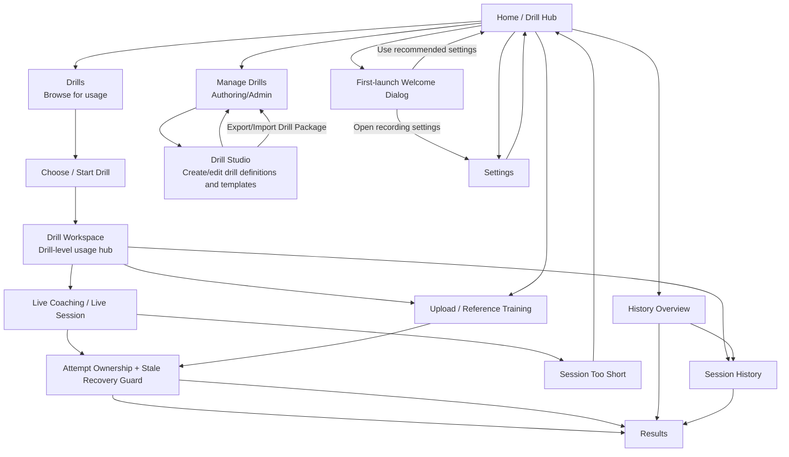

# CaliVision

CaliVision is a drill-centric Android training app for calisthenics practice. It connects live coaching, upload analysis, drill authoring, and replay review in one workflow.

## Why I built CaliVision

I built CaliVision because i want help in visualizing my handstand stack. I was already recording videos and replaying them manually.
I wanted to compare it against references, and get structured feedback quickly enough to adjust in the next set.

The goal is simple: shorten the feedback cycle for calisthenics and handstand training through analysis, comparison, and drill-centered review.

CaliVision is also an active experiment in practical AI-assisted software development (aka vibe coding), where AI helps accelerate the work but does not replace human judgment. I come from a data architecture and business intelligence background so i have little to no App development experience. So why not take a challenge in creating an android app that use computer vison to analyse my body skeleton and supervise a ML classification model to recognize phases of a handstand push-up.

## How this project is built

This project uses a human-led, AI-assisted workflow:

- **ChatGPT** is used as a planning and architecture partner: clarifying requirements, pressure-testing design choices, explaining tradeoffs, and reviewing proposed changes.
- **Codex** is used as an execution partner: implementing scoped repository changes, updating docs, and preparing PR-ready diffs.
- **Human owner (me)** remains the decision-maker: selecting direction, compiling/integrating in VS Code, validating behavior, and manually testing the app on real workflows.

Short version for skimmers: **ChatGPT helps plan, Codex helps implement, and I approve + validate everything before it ships.**



## Human-in-the-loop SDLC

This is intentionally **not** fully autonomous software development. AI contributes speed, structure, and implementation support, while human oversight controls quality and product direction.



## What the app does

CaliVision keeps users in drill context from start to review:

- **Home / Drill Hub**: launch point for practice and navigation (Start Live Coaching, Upload Video, Drills, Manage Drills, History, Settings).
- **Drills**: user-facing drill browsing path for operational use. Selecting a drill opens **Drill Workspace**.
- **Manage Drills**: create/edit path for drill packages (new/import/open to Drill Studio/export/delete).
- **Drill Studio**: create/edit drill definitions and templates.
- **Drill Workspace**: per-drill usage hub for coaching, upload attempts, and session review.
- **Live Session**: countdown-gated real-time coaching with overlays.
- **Upload / Reference Training**: analyze imported clips and optionally produce drill-linked references.
- **History Overview**: top-level history landing page from Home for at-a-glance review.
- **Session History (History screen)**: drill-aware detailed history, filtering, and compare flows.
- **Results**: inspect per-session outcomes and replay assets.

## Core workflows



## UI flow

This product-level UI flow mirrors [`docs/diagrams/ui-flow.md`](docs/diagrams/ui-flow.md).



For detailed technical and sequence diagrams (including import/export internals), see [`docs/diagrams/`](docs/diagrams).

## Tech stack

- Kotlin + Jetpack Compose
- AndroidX Navigation + ViewModel state flows
- Room database + blob/media storage
- ML Kit on-device pose detection (landmark extraction)
- Custom on-device motion analysis, biomechanics, and drill scoring modules
- In-app upload analysis owned by `UploadVideoViewModel` (non-durable; fails safe on process death)

## ML + movement analysis (current state)

CaliVision already uses **on-device machine-learning pose detection** to extract body landmarks from both:

- **Live camera sessions**
- **Uploaded videos**

Those landmarks then flow through CaliVision’s own analysis stack:

- motion analysis + phase detection
- biomechanics metrics
- timeline overlays and structured feedback
- drill scoring + reference comparison outputs

Today’s seeded drill baselines and v1 movement templates are **authored rules and movement-analysis heuristics** built in the app’s domain layer. They are not a fully self-learning end-to-end model.

The reference-template workflow is being structured so scoring and comparison can become more adaptive and data-informed over time as more drill data is captured, while remaining product-guided and technically explicit about what is rule-authored vs learned.

## How the system works

1. UI routes in `ui/navigation/Nav.kt` coordinate screen transitions.
2. Workflow view models (`ui/live`, `ui/upload`, `ui/drillstudio`) orchestrate user flows.
3. Domain modules (`drills`, `movementprofile`) provide drill behavior and reference-analysis behavior.
4. Analysis modules (`pose`, `motion`, `biomechanics`) combine ML landmark extraction with CaliVision-authored scoring/classification logic.
5. Recording/export modules (`recording`, `media`) generate replay outputs with fallback.
6. `storage/repository/SessionRepository` persists sessions, drill metadata, media status, and references.
7. Export processing ownership is attempt-scoped (`activeProcessingAttemptId` + owner metadata) so stale/retried workers cannot regress terminal state.
8. `app/src/main/assets/drill_catalog/drill_catalog_v1.json` is the canonical seeded source; seeded reference/baseline templates are derived from catalog drill metadata at startup (no standalone `assets/reference_templates/*.json` dependency).

## Project structure / docs map

- Top-level architecture: [`ARCHITECTURE.md`](ARCHITECTURE.md)
- Contribution guide: [`CONTRIBUTING.md`](CONTRIBUTING.md)
- Testing guide: [`TESTING.md`](TESTING.md)
- Docs index: [`docs/README.md`](docs/README.md)
- Architecture deep dives: [`docs/architecture/`](docs/architecture)
- Feature behavior: [`docs/features/`](docs/features)
- Decision records: [`docs/decisions/`](docs/decisions)
- Diagrams: [`docs/diagrams/`](docs/diagrams)

## Running locally

Prerequisites:

- JDK 17
- Android SDK 34 (compileSdk/targetSdk 34)
- `gradle` available on PATH (the Gradle wrapper is not checked in)

Commands:

```bash
gradle testDebugUnitTest
gradle :app:assembleDebug
```

## Documentation

If you change workflow names, routes, navigation behavior, architecture boundaries, replay/export/media behavior, or upload/reference behavior, **update docs and diagrams in the same PR**.

Start here:

- [`docs/features/current-user-flows.md`](docs/features/current-user-flows.md)
- [`docs/architecture/system-overview.md`](docs/architecture/system-overview.md)
- [`docs/diagrams/ui-flow.md`](docs/diagrams/ui-flow.md)

## Screenshots / media assets

No screenshots are currently checked in.

Expected README asset placeholders:

- `docs/assets/home-drill-hub.png`
- `docs/assets/live-session.png`
- `docs/assets/upload-reference-training.png`
- `docs/assets/results-session-history.png`

When assets are added, keep them optimized and update this section.
