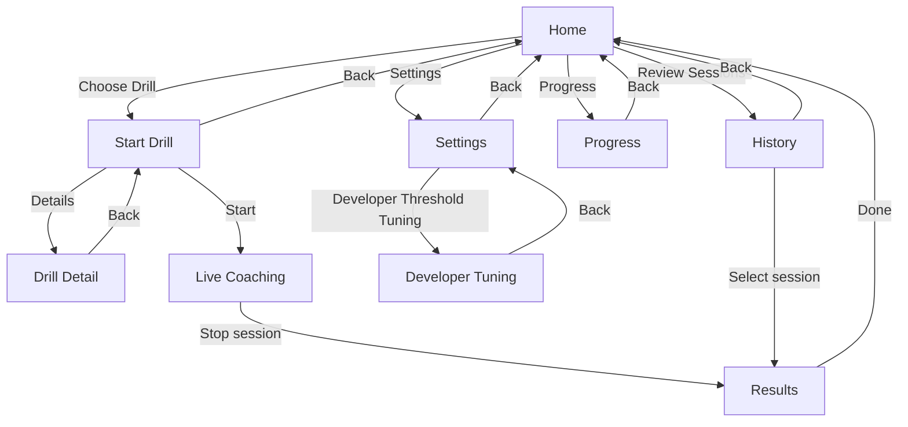

# Inversion Coach (Android)

Inversion Coach is an Android app for calisthenics and posture coaching.

## Architecture (motion-aware)

```text
CAMERA FRAME
-> pose detection landmarks (ML Kit)
-> temporal smoothing (EMA + confidence weighting)
-> joint angle calculations
-> movement phase detection (FSM)
-> posture fault detection (persistence gated)
-> live cue generation (cooldown + priority)
-> session rep summary
```

Core code paths:
- Camera + ML inference: `pose/PoseAnalyzer.kt`
- Legacy smoothing + biomech scoring path: `pose/PoseSmoother.kt`, `biomechanics/*`
- New motion analysis pipeline: `motion/*`
- Live UI integration: `ui/live/*`
- Drill selection + preview animation: `ui/startdrill/*`, `ui/components/DrillPreviewAnimation.kt`

## Motion pipeline modules

New reusable modules under `app/src/main/java/com/inversioncoach/app/motion`:
- `PoseFrame`: timestamp + landmarks + per-landmark confidence
- `SmoothedPoseFrame`: filtered landmarks + per-joint velocity
- `AngleFrame`: named angles, trunk lean, pelvic tilt proxy, line deviation
- `MovementState`: phase, progress, confidence, start time, rep count
- `FaultEvent`: code, severity, message, side, start/end
- `TemporalPoseSmoother`: EMA smoothing with confidence weighting and missing-joint fallback
- `AngleEngine`: 2D angle calculations (extensible for future 3D)
- `MovementPhaseDetector`: FSM with hysteresis via dwell time
- `FaultDetectionEngine`: persistence-gated fault rules
- `FeedbackEngine`: one-cue-at-a-time, cooldown-based cueing
- `MotionAnalysisPipeline`: end-to-end orchestrator

## Drill metadata system

`DrillCatalog.kt` defines drill metadata using Kotlin data classes (JSON-like shape):
- id, displayName, category, level, equipment, movementPattern
- primaryJoints, trackedAngles, requiredLandmarks
- phaseModel, postureRules, cueLibrary
- thumbnail/animation refs
- repCountingEnabled, holdModeEnabled
- checkpoints and keyframe animation source

The catalog is currently focused on six handstand-focused exercises (foundations + press progressions).


### Available drills (with categories)

| Drill | Category | Level |
|---|---|---|
| Free Standing Handstand | Handstand | Intermediate |
| Wall Assisted Handstand | Handstand | Beginner |
| Pike Push-Up | Handstand Push | Beginner |
| Elevated Pike Push-Up | Handstand Push | Intermediate |
| Free Standing Handstand Push-Up | Handstand Push | Intermediate |
| Wall Assisted Handstand Push-Up | Handstand Push | Intermediate |

## Drill preview animation system

- Previews are procedural 2D dummy animations.
- Source of truth: keyframes (`DrillPreviewKeyframe`) in `DrillCatalog.kt`.
- Runtime interpolation and rendering on Compose `Canvas` in `DrillPreviewAnimation.kt`.
- No external copyrighted videos are used.

## Drill selection UX

Start Drill screen now includes:
- a focused handstand exercise library list
- looping preview animation per drill
- level tag + movement pattern tag
- tracked checkpoints summary
- details button that opens a drill detail screen with posture checklist

## App page map (navigation flow)

Current app navigation pages and routes:
- `Home` (`home`)
- `Start Drill` (`start`)
- `Drill Detail` (`drillDetail/{drill}`)
- `Live Coaching` (`live/{drill}/{voice}/{record}/{skeleton}/{idealLine}/{zoomOutCamera}`)
- `Results` (`results/{sessionId}`)
- `History` (`history`)
- `Progress` (`progress`)
- `Settings` (`settings`)
- `Developer Tuning` (`settings/dev-tuning`)



## Debug / tuning tools

- Live debug overlay now includes current phase, active fault, and rep count.
- Settings includes navigation to **Developer threshold tuning** screen.
- Developer screen supports live threshold tuning for key posture/fault limits.

## Session validity gating and issue aggregation (developer note)

- Live scoring now applies an explicit frame-validity gate before analysis persistence.
- A frame must satisfy confidence, drill-required landmark visibility, scale/distance bounds, and expected orientation (side-view drills).
- Invalid frames are excluded from score computation, issue timeline generation, and end-of-session summary metrics.
- Invalid-frame reasons are counted and persisted in session metrics metadata for diagnostics (`low_confidence`, `missing_required_landmarks`, `too_close_to_camera`, `wrong_orientation`, etc.).
- Per-frame duplicate issue spam is replaced by event aggregation:
  - identical consecutive issues are merged
  - each merged event tracks start/end/duration, peak severity, and representative cue
  - short transient events are debounced out via a minimum-duration threshold
- Session summary output is derived from valid-frame metrics + aggregated issue events.
- If valid frame count is below threshold, session is marked invalid/insufficient-data and the user gets a retry-oriented focus message instead of misleading coaching output.
- Live session finalization is lifecycle-safe: if the Live Coaching screen is disposed (navigation/system interruption), the current session is finalized in the background to avoid orphaned `completedAtMs=0` records.

## How to add a new drill

1. Add/confirm the app drill enum (`model/Models.kt`) for runtime routing.
2. Add drill metadata in `motion/DrillCatalog.kt` using `def(...)`.
3. Add an animation spec (`symmetricSpec`, `lungeSpec`, or a new custom spec).
4. Define phases, faults, cues, movement pattern, and rep mode.
5. Add future rule placeholders for expected analysis strategy.
6. Wire analyzer thresholds in the motion pipeline when posture detection is added for that drill.

## Defining joints and keyframes

- Use normalized coordinates (`0f..1f`) in `NormalizedPoint`
- Include key poses when applicable:
  - neutral
  - start
  - mid eccentric
  - bottom
  - mid concentric
  - top
  - optional hold
- Keep first/last poses compatible for smooth loops

## Mirroring rules

- Enable `mirroredSupported = true` on `SkeletonAnimationSpec`
- Renderer can request mirrored playback
- Engine swaps left/right joint keys and flips x-axis (`x -> 1 - x`)

## Tests

Unit tests cover:
- keyframe interpolation
- mirroring
- loop continuity
- animation loading
- drill schema field integrity

## Setup

### Prerequisites

- Android Studio (latest stable) with Android SDK 34
- JDK 17 (the project compiles against Java/Kotlin 17 toolchains)
- Gradle 8.14+ available on PATH (this repo currently does not include `gradlew`)

### Local run

1. Open the project in Android Studio.
2. Let Gradle sync and install missing SDK components.
3. Run the `app` configuration on a physical device (recommended for camera + ML Kit) or emulator with camera support.
4. Grant camera permission when prompted.

## Build, test, and release

### Unit tests

```bash
gradle :app:testDebugUnitTest
```

### Lint

```bash
gradle :app:lintDebug
```

### Debug APK

```bash
gradle :app:assembleDebug
```

### Release APK (local signing)

Pass signing values as Gradle properties (for example via `~/.gradle/gradle.properties`):

- `RELEASE_STORE_FILE`
- `RELEASE_STORE_PASSWORD`
- `RELEASE_KEY_ALIAS`
- `RELEASE_KEY_PASSWORD`
- Optional: `APP_VERSION_CODE`, `APP_VERSION_NAME`

Then build:

```bash
gradle :app:assembleRelease
```

If release signing properties are omitted, the project falls back to the debug signing config for `release` builds (for local-only validation).

## APK installation flow

- Build locally with `gradle :app:assembleDebug` and install from `app/build/outputs/apk/debug/`.
- Or download the latest release APK from GitHub using:

```bash
bash scripts/download-latest-apk.sh <owner/repo> <output_dir>
```
