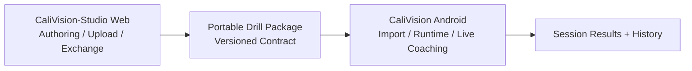
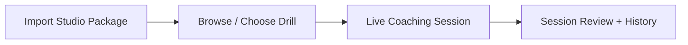
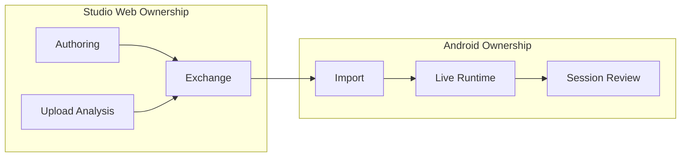
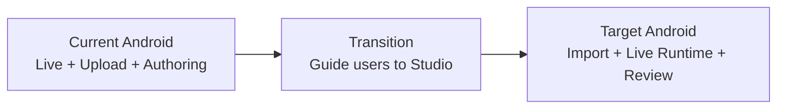
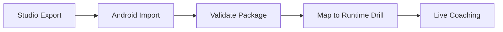

# CaliVision (Android)

CaliVision Android is the **mobile runtime and live-coaching client** in the broader CaliVision ecosystem.

- **Android app (this repo):** edge-device coaching runtime, camera-first feedback, portable drill package import/consumption.
- **CaliVision-Studio (web):** long-term source of truth for drill authoring, upload/browser analysis, and drill exchange workflows.

👉 Studio repo: **https://github.com/Voycepeh/CaliVision-Studio**

## Product direction (current → target)

CaliVision currently contains a mixed set of capabilities (live coaching + upload flows + mobile drill authoring surfaces). The direction is to clarify ownership across two products:

- **Keep and strengthen on Android:**
  - live coaching on-device
  - low-friction mobile drill usage
  - runtime guidance with phone camera portability
  - import and consume Studio-authored portable drill packages
  - review session results/history
- **Shift toward Studio web:**
  - full drill authoring and management as primary source of truth
  - browser-centered upload video analysis and exchange workflows
  - heavier package publishing/management operations

This repo documents that transition honestly: some legacy/mobile authoring and upload paths still exist, but they are now treated as transitional rather than long-term Android ownership.

## Why mobile still matters

Live coaching belongs on edge devices because phones provide:

- instant camera access at training location
- low setup friction between sets
- portability for gym/park/home workflows
- direct feedback loops without desktop dependency

Android remains the best place for **real-time, in-session coaching execution**.

## Ecosystem relationship



## Mobile runtime workflow



## Studio/mobile boundary split



## Transition snapshot (current → target)



## Current state vs future direction

### Current state in Android

- Live coaching runtime and session review are actively used core surfaces.
- Upload video and mobile drill-authoring capabilities still exist in parts of the app.
- Portable drill package compatibility seams are already in place.

### Target direction

- Android becomes the clear runtime/live-coaching client.
- Studio web becomes the primary authoring/upload/exchange hub.
- Mobile drill actions trend toward lightweight operations (import, browse, preview, and minimal metadata operations where needed for runtime continuity).

## How drill packages connect Studio and Android

Portable drill packages are the bridge between repos:

1. Studio authors and exports drill packages.
2. Android imports and validates packages.
3. Android maps package content into runtime drill records.
4. Live coaching/session flows consume those runtime drills.

See:

- [`docs/drill-package-contract.md`](docs/drill-package-contract.md)
- [`docs/architecture/package-import-runtime-flow.md`](docs/architecture/package-import-runtime-flow.md)
- [`docs/architecture/studio-mobile-boundary.md`](docs/architecture/studio-mobile-boundary.md)
- [`docs/studio-android-compatibility.md`](docs/studio-android-compatibility.md)

## Package consumption flow




## Portable package boundary in code

To keep Studio-authored package compatibility explicit, Android package handling is organized under `app/src/main/java/com/inversioncoach/app/drillpackage/*`:

- `model/` - portable contract models + boundary constants
- `io/` - package JSON/file codecs
- `validation/` - contract validation rules/reports
- `mapping/` - portable ↔ runtime/catalog mappers + canonical joint semantics
- `importing/` - parse→validate→map import pipeline result seam

This separation is intentional: runtime/live-coaching internals should consume mapped runtime structures, not directly depend on authoring-specific portable payload details.

## User migration story (mobile-first users)

Users who previously relied on mobile upload/drill authoring can transition progressively:

1. Continue using Android for live coaching and session review.
2. Begin creating/refining drills in Studio web.
3. Export/import packages into Android for runtime usage.
4. Move heavier upload/authoring tasks to web while keeping mobile as the in-session coaching device.

## Documentation map

- Top-level architecture: [`ARCHITECTURE.md`](ARCHITECTURE.md)
- Docs index: [`docs/README.md`](docs/README.md)
- Current user workflows: [`docs/features/current-user-flows.md`](docs/features/current-user-flows.md)
- Studio/mobile split: [`docs/architecture/studio-mobile-boundary.md`](docs/architecture/studio-mobile-boundary.md)
- Package import runtime flow: [`docs/architecture/package-import-runtime-flow.md`](docs/architecture/package-import-runtime-flow.md)
- Mobile direction roadmap: [`docs/roadmap/mobile-direction.md`](docs/roadmap/mobile-direction.md)

## Running locally

Prerequisites:

- JDK 17
- Android SDK 34 (compileSdk/targetSdk 34)
- `gradle` on PATH (Gradle wrapper is not checked in)

Commands:

```bash
gradle testDebugUnitTest
gradle :app:assembleDebug
```

## Documentation maintenance rule

If you change workflow ownership, navigation boundaries, package contract/import behavior, live vs upload scope, or terminology, update relevant docs/diagrams in this repo **and** cross-reference needed updates in Studio docs.
