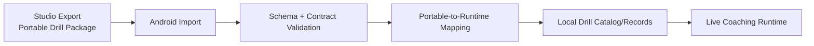

# Package Import → Runtime Flow (Studio to Android)

This document describes how Studio-authored drill packages are consumed by Android runtime/live coaching workflows.

Studio repo: https://github.com/Voycepeh/CaliVision-Studio

## End-to-end flow

## Canonical Android import seam

Android now keeps the package boundary in one explicit seam:

`DrillPackageImportPipeline.parseAndValidate(rawJson)`

- decode with `DrillPackageJsonCodec`
- validate with `DrillPackageValidator`
- map to runtime-ready catalog via `DrillCatalogPortableMapper`
- return structured outcome (`Success`, decode/validation/mapping failure)

This avoids scattering parse/validate/map logic across UI flows.

## Runtime consumption sequence

1. Studio creates drill package using portable schema.
2. Android import surface receives package JSON/file.
3. Validator enforces schema/version and data integrity.
4. Mapper converts portable structures into runtime records.
5. Drill appears in Android drill selection/workspace.
6. Live coaching session consumes runtime drill definitions.

## Portable package code map

- Contract models/constants: `drillpackage/model/*`
- JSON/file IO: `drillpackage/io/*`
- Portable semantics + mapping: `drillpackage/mapping/*`
- Validation: `drillpackage/validation/*`
- Import seam result orchestration: `drillpackage/importing/*`

## Canonical pose/joint semantics

Portable pose assumptions are centralized for importer + mapper consistency:

- canonical joint naming (`PortableJointNames`, `PortablePoseSemantics`)
- normalized coordinate bounds (`DrillPackageContract`)
- neutral portable views (`FRONT`, `SIDE`, `BACK`)

## Contract responsibilities

- Preserve schema compatibility across app and Studio updates.
- Treat compatibility regressions as high-priority integration defects.
- Keep portable camera view semantics neutral (`FRONT`, `SIDE`, `BACK`).
- Keep runtime models and portable models intentionally distinct.

## Why this matters for product split

Portable package flow allows:

- Studio to specialize in authoring/exchange.
- Android to specialize in on-device runtime/live coaching.
- Both repos to evolve independently while staying contract-compatible.
