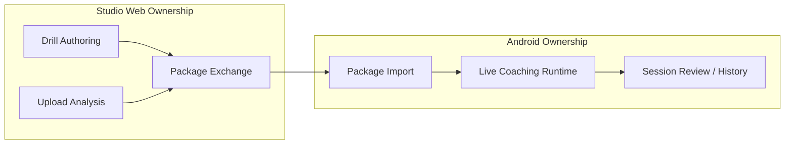

# Studio ↔ Mobile Boundary

This document defines product responsibility split between CaliVision-Studio web and CaliVision Android.

Studio repo: https://github.com/Voycepeh/CaliVision-Studio

## Boundary summary

- **Studio (web) owns:**
  - full drill authoring/editing lifecycle
  - drill publishing/exchange workflows
  - browser-first upload video analysis direction
  - long-term source of truth for authored drill definitions
- **Android (mobile) owns:**
  - edge-device live coaching runtime
  - package import and runtime consumption
  - low-friction in-session portability
  - session review/history in mobile context

## Boundary diagram

## Transitional surfaces inside Android

These are present today but directionally de-emphasized for long-term ownership:

- full Drill Studio authoring on mobile
- mobile-first upload video analysis as a primary product pillar
- heavy package publishing/management from Android

They may continue during migration but should not be treated as the strategic center.

## Decision heuristic for contributors

When proposing Android changes, prioritize:

1. Runtime/live-coaching quality.
2. Package import reliability and compatibility.
3. Session review and portable mobile UX.

Treat heavy new Android authoring/upload features as exceptional and transition-justified only.

## Cross-repo documentation rule

If boundary ownership changes, update both:

- Android docs in this repo.
- Studio docs in https://github.com/Voycepeh/CaliVision-Studio.
