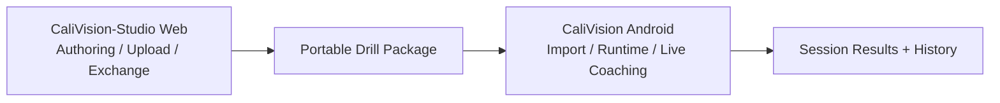

# System Overview

CaliVision now operates as a two-surface ecosystem:

- **CaliVision Android (this repo):** mobile runtime/live coaching app.
- **CaliVision-Studio (web):** drill authoring/upload/exchange hub.

Studio link: https://github.com/Voycepeh/CaliVision-Studio

## Ecosystem overview

## Android workflow surfaces (primary)

- **Home / Drill Hub:** primary navigation and launch surface.
- **Drills / Drill Workspace:** drill selection and drill-scoped runtime actions.
- **Live Session:** countdown-gated real-time coaching on-device.
- **History + Results:** persisted outcomes, replay access, session review.
- **Package import surfaces:** ingest Studio-authored drills into Android runtime.

## Transitional Android surfaces (currently present)

- **Manage Drills / Drill Studio:** available now, but no longer documented as long-term primary authoring home.
- **Upload / Reference Training:** available now, directionally moving toward web/browser workflows in Studio.

## Runtime subsystems

- **Navigation/UI:** `ui/navigation`, feature screens in `ui/**`.
- **Workflow orchestrators:** live/upload/drill studio view models.
- **Domain:** `drills`, `movementprofile`.
- **Pose extraction (ML):** on-device pose detection + landmark extraction in `pose`.
- **Analysis (authored logic):** `motion`, `biomechanics`, drill scoring, coaching cues.
- **Media:** recording, overlay timeline, annotated export, replay resolver.
- **Persistence:** Room + repository + blob storage.

## Package contract role

Portable drill packages are the integration seam between Studio and Android.

1. Studio authors and exports package JSON.
2. Android imports and validates package JSON.
3. Android maps portable structures into runtime drill records.
4. Live coaching consumes mapped runtime drills.

## Operational invariants

1. Drill context remains recoverable across live/results/history flows.
2. Session truth persists even if annotated export fails.
3. Replay prefers verified annotated output, then verified raw fallback.
4. Package compatibility with Studio is treated as a critical contract.
5. Workflow/ownership naming changes require docs and diagrams updates in the same PR.
