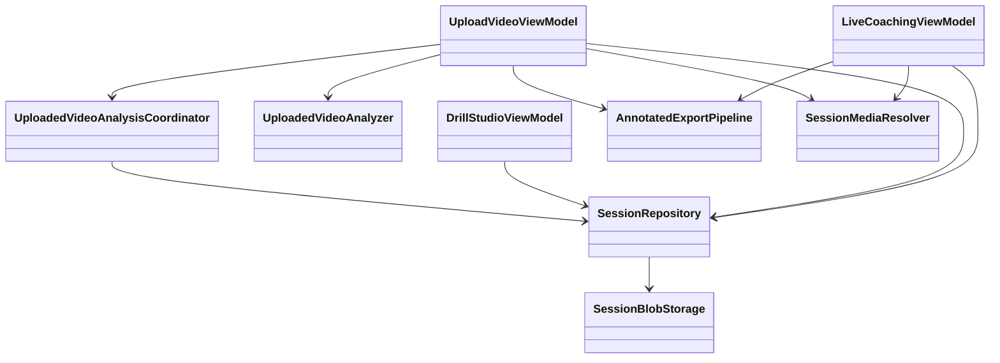

# Diagram: Core Class Relationships

```mermaid
classDiagram
    class LiveCoachingViewModel
    class UploadVideoViewModel
    class DrillStudioViewModel
    class UploadedVideoAnalyzer
    class UploadedVideoAnalysisCoordinator
    class AnnotatedExportPipeline
    class SessionMediaResolver
    class SessionRepository
    class SessionBlobStorage

    LiveCoachingViewModel --> AnnotatedExportPipeline
    LiveCoachingViewModel --> SessionMediaResolver
    LiveCoachingViewModel --> SessionRepository

    UploadVideoViewModel --> UploadedVideoAnalyzer
    UploadVideoViewModel --> UploadedVideoAnalysisCoordinator
    UploadVideoViewModel --> AnnotatedExportPipeline
    UploadVideoViewModel --> SessionMediaResolver
    UploadVideoViewModel --> SessionRepository

    DrillStudioViewModel --> SessionRepository
    UploadedVideoAnalysisCoordinator --> SessionRepository
    SessionRepository --> SessionBlobStorage
```
