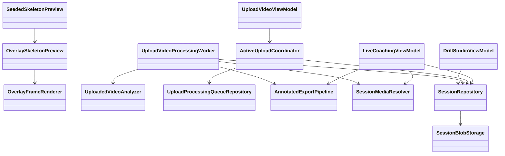

# Diagram: Core Class Relationships

```mermaid
classDiagram
    class LiveCoachingViewModel
    class UploadVideoViewModel
    class DrillStudioViewModel
    class OverlayFrameRenderer
    class OverlaySkeletonPreview
    class SeededSkeletonPreview
    class UploadedVideoAnalyzer
    class ActiveUploadCoordinator
    class UploadVideoProcessingWorker
    class UploadProcessingQueueRepository
    class AnnotatedExportPipeline
    class SessionMediaResolver
    class SessionRepository
    class SessionBlobStorage

    LiveCoachingViewModel --> AnnotatedExportPipeline
    LiveCoachingViewModel --> SessionMediaResolver
    LiveCoachingViewModel --> SessionRepository

    UploadVideoViewModel --> ActiveUploadCoordinator
    ActiveUploadCoordinator --> UploadProcessingQueueRepository
    ActiveUploadCoordinator --> SessionRepository
    UploadVideoProcessingWorker --> UploadedVideoAnalyzer
    UploadVideoProcessingWorker --> AnnotatedExportPipeline
    UploadVideoProcessingWorker --> SessionMediaResolver
    UploadVideoProcessingWorker --> SessionRepository

    DrillStudioViewModel --> SessionRepository
    OverlaySkeletonPreview --> OverlayFrameRenderer
    SeededSkeletonPreview --> OverlaySkeletonPreview
    SessionRepository --> SessionBlobStorage
```
