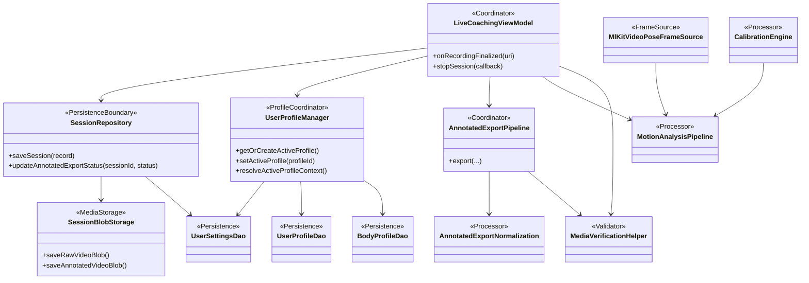

# Class Diagram (Key Architecture Classes)

```mermaid
classDiagram
  class LiveCoachingViewModel {
    <<Coordinator>>
    +onRecordingFinalized(uri)
    +stopSession(callback)
  }

  class SessionRepository {
    <<PersistenceBoundary>>
    +saveSession(record)
    +updateAnnotatedExportStatus(sessionId, status)
  }

  class UserProfileManager {
    <<ProfileCoordinator>>
    +getOrCreateActiveProfile()
    +setActiveProfile(profileId)
    +resolveActiveProfileContext()
  }

  class UserSettingsDao {
    <<Persistence>>
  }

  class UserProfileDao {
    <<Persistence>>
  }

  class BodyProfileDao {
    <<Persistence>>
  }

  class SessionBlobStorage {
    <<MediaStorage>>
    +saveRawVideoBlob()
    +saveAnnotatedVideoBlob()
  }

  class AnnotatedExportPipeline {
    <<Coordinator>>
    +export(...)
  }

  class AnnotatedExportNormalization {
    <<Processor>>
  }

  class MediaVerificationHelper {
    <<Validator>>
  }

  class MlKitVideoPoseFrameSource {
    <<FrameSource>>
  }

  class MotionAnalysisPipeline {
    <<Processor>>
  }

  class CalibrationEngine {
    <<Processor>>
  }

  LiveCoachingViewModel --> SessionRepository
  LiveCoachingViewModel --> UserProfileManager
  LiveCoachingViewModel --> AnnotatedExportPipeline
  LiveCoachingViewModel --> MotionAnalysisPipeline
  LiveCoachingViewModel --> MediaVerificationHelper
  SessionRepository --> SessionBlobStorage
  SessionRepository --> UserSettingsDao
  UserProfileManager --> UserSettingsDao
  UserProfileManager --> UserProfileDao
  UserProfileManager --> BodyProfileDao
  AnnotatedExportPipeline --> AnnotatedExportNormalization
  AnnotatedExportPipeline --> MediaVerificationHelper
  MlKitVideoPoseFrameSource --> MotionAnalysisPipeline
  CalibrationEngine --> MotionAnalysisPipeline
```
