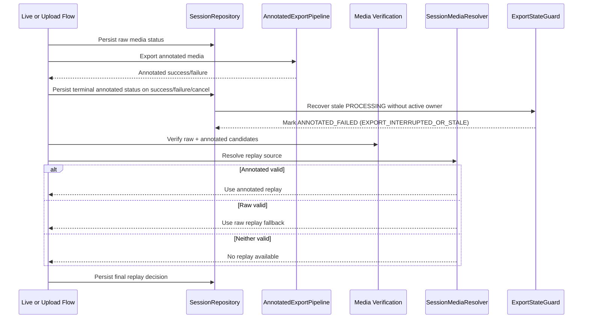

# Sequence: Export / Replay / Fallback

```mermaid
sequenceDiagram
    participant Flow as Live or Upload Flow
    participant Repo as SessionRepository
    participant Export as AnnotatedExportPipeline
    participant Verify as Media Verification
    participant Resolver as SessionMediaResolver
    participant Guard as ExportStateGuard

    Flow->>Repo: Persist raw media status
    Flow->>Export: Export annotated media
    Export-->>Flow: Annotated success/failure
    Flow->>Repo: Persist terminal annotated status on success/failure/cancel
    Repo->>Guard: Recover stale PROCESSING without active owner
    Guard-->>Repo: Mark ANNOTATED_FAILED (EXPORT_INTERRUPTED_OR_STALE)
    Flow->>Verify: Verify raw + annotated candidates
    Flow->>Resolver: Resolve replay source

    alt Annotated valid
      Resolver-->>Flow: Use annotated replay
    else Raw valid
      Resolver-->>Flow: Use raw replay fallback
    else Neither valid
      Resolver-->>Flow: No replay available
    end

    Flow->>Repo: Persist final replay decision
```
