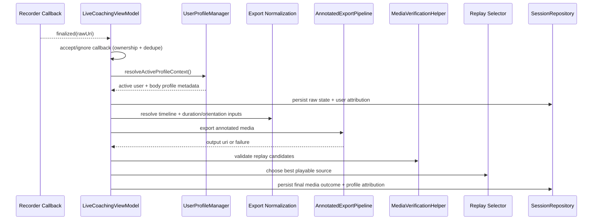

# Sequence: Export Finalization

```mermaid
sequenceDiagram
  participant REC as Recorder Callback
  participant VM as LiveCoachingViewModel
  participant UPM as UserProfileManager
  participant NORM as Export Normalization
  participant EXP as AnnotatedExportPipeline
  participant VERIFY as MediaVerificationHelper
  participant SEL as Replay Selector
  participant REPO as SessionRepository

  REC-->>VM: finalized(rawUri)
  VM->>VM: accept/ignore callback (ownership + dedupe)
  VM->>UPM: resolveActiveProfileContext()
  UPM-->>VM: active user + body profile metadata
  VM->>REPO: persist raw state + user attribution
  VM->>NORM: resolve timeline + duration/orientation inputs
  VM->>EXP: export annotated media
  EXP-->>VM: output uri or failure
  VM->>VERIFY: validate replay candidates
  VM->>SEL: choose best playable source
  VM->>REPO: persist final media outcome + profile attribution
```
