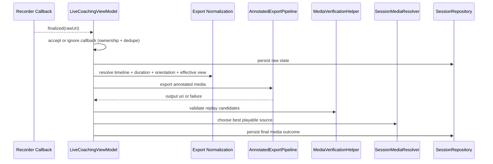

# Sequence: Export Finalization

```mermaid
sequenceDiagram
    participant REC as Recorder Callback
    participant VM as LiveCoachingViewModel
    participant NORM as Export Normalization
    participant EXP as AnnotatedExportPipeline
    participant VERIFY as MediaVerificationHelper
    participant RES as SessionMediaResolver
    participant REPO as SessionRepository

    REC-->>VM: finalized(rawUri)
    VM->>VM: accept or ignore callback (ownership + dedupe)
    VM->>REPO: persist raw state
    VM->>NORM: resolve timeline + duration + orientation + effective view
    VM->>EXP: export annotated media
    EXP-->>VM: output uri or failure
    VM->>VERIFY: validate replay candidates
    VM->>RES: choose best playable source
    VM->>REPO: persist final media outcome
```
