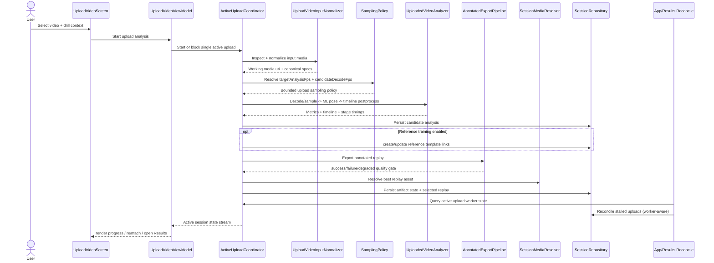

# Sequence: Upload / Analysis Flow

```mermaid
sequenceDiagram
    actor User
    participant UI as UploadVideoScreen
    participant VM as UploadVideoViewModel
    participant Coord as ActiveUploadCoordinator
    participant Normalize as UploadVideoInputNormalizer
    participant Sample as SamplingPolicy
    participant Analyzer as UploadedVideoAnalyzer
    participant Export as AnnotatedExportPipeline
    participant Resolver as SessionMediaResolver
    participant Repo as SessionRepository
    participant App as App/Results Reconcile

    User->>UI: Select video + drill context
    UI->>VM: Start upload analysis
    VM->>Coord: Start or block single active upload
    Coord->>Normalize: Inspect + normalize input media
    Normalize-->>Coord: Working media uri + canonical specs
    Coord->>Sample: Resolve targetAnalysisFps + candidateDecodeFps
    Sample-->>Coord: Bounded upload sampling policy
    Coord->>Analyzer: Decode/sample -> ML pose -> timeline postprocess
    Analyzer-->>Coord: Metrics + timeline + stage timings
    Coord->>Repo: Persist candidate analysis

    opt Reference training enabled
      Coord->>Repo: create/update reference template links
    end

    Coord->>Export: Export annotated replay
    Export-->>Coord: success/failure/degraded quality gate
    Coord->>Resolver: Resolve best replay asset
    Coord->>Repo: Persist artifact state + selected replay
    App->>Coord: Query active upload worker state
    App->>Repo: Reconcile stalled uploads (worker-aware)
    Coord-->>VM: Active session state stream
    VM-->>UI: render progress / reattach / open Results
```
