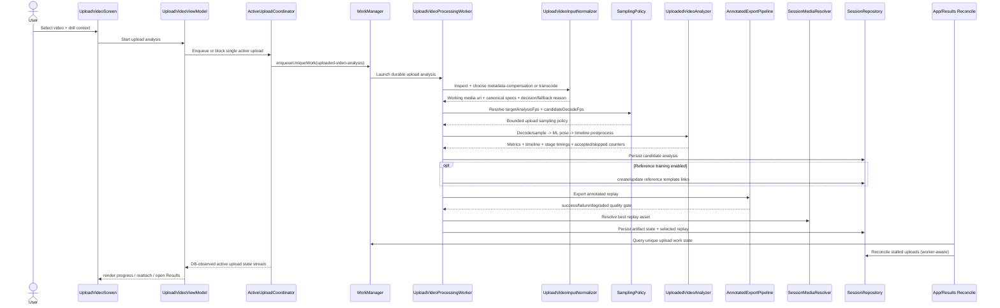

# Sequence: Upload / Analysis Flow

```mermaid
sequenceDiagram
    actor User
    participant UI as UploadVideoScreen
    participant VM as UploadVideoViewModel
    participant Coord as ActiveUploadCoordinator
    participant WM as WorkManager
    participant Worker as UploadVideoProcessingWorker
    participant Normalize as UploadVideoInputNormalizer
    participant Sample as SamplingPolicy
    participant Analyzer as UploadedVideoAnalyzer
    participant Export as AnnotatedExportPipeline
    participant Resolver as SessionMediaResolver
    participant Repo as SessionRepository
    participant App as App/Results Reconcile

    User->>UI: Select video + drill context
    UI->>VM: Start upload analysis
    VM->>Coord: Enqueue or block single active upload
    Coord->>WM: enqueueUniqueWork(uploaded-video-analysis)
    WM->>Worker: Launch durable upload analysis
    Worker->>Normalize: Inspect + choose metadata-compensation or transcode
    Normalize-->>Worker: Working media uri + canonical specs + decision/fallback reason
    Worker->>Sample: Resolve targetAnalysisFps + candidateDecodeFps
    Sample-->>Worker: Bounded upload sampling policy
    Worker->>Analyzer: Decode/sample -> ML pose -> timeline postprocess
    Analyzer-->>Worker: Metrics + timeline + stage timings + accepted/skipped counters
    Worker->>Repo: Persist candidate analysis

    opt Reference training enabled
      Worker->>Repo: create/update reference template links
    end

    Worker->>Export: Export annotated replay
    Export-->>Worker: success/failure/degraded quality gate
    Worker->>Resolver: Resolve best replay asset
    Worker->>Repo: Persist artifact state + selected replay
    App->>WM: Query unique upload work state
    App->>Repo: Reconcile stalled uploads (worker-aware)
    Coord-->>VM: DB-observed active upload state stream
    VM-->>UI: render progress / reattach / open Results
```
