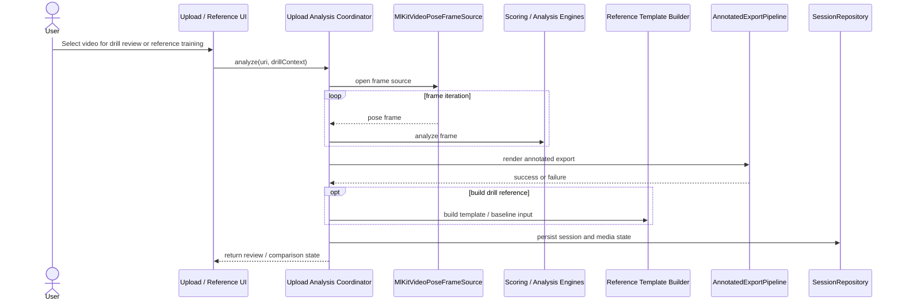

# Sequence: Imported Video Analysis

```mermaid
sequenceDiagram
    actor User
    participant UI as Upload / Reference UI
    participant COORD as Upload Analysis Coordinator
    participant SRC as MlKitVideoPoseFrameSource
    participant SCORE as Scoring / Analysis Engines
    participant REF as Reference Template Builder
    participant EXP as AnnotatedExportPipeline
    participant REPO as SessionRepository

    User->>UI: Select video for drill review or reference training
    UI->>COORD: analyze(uri, drillContext)
    COORD->>SRC: open frame source
    loop frame iteration
      SRC-->>COORD: pose frame
      COORD->>SCORE: analyze frame
    end
    COORD->>EXP: render annotated export
    EXP-->>COORD: success or failure
    opt build drill reference
      COORD->>REF: build template / baseline input
    end
    COORD->>REPO: persist session and media state
    COORD-->>UI: return review / comparison state
```
