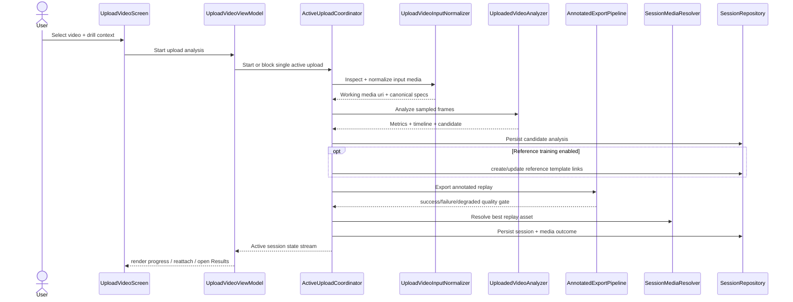

# Sequence: Upload / Analysis Flow

```mermaid
sequenceDiagram
    actor User
    participant UI as UploadVideoScreen
    participant VM as UploadVideoViewModel
    participant Coord as ActiveUploadCoordinator
    participant Normalize as UploadVideoInputNormalizer
    participant Analyzer as UploadedVideoAnalyzer
    participant Export as AnnotatedExportPipeline
    participant Resolver as SessionMediaResolver
    participant Repo as SessionRepository

    User->>UI: Select video + drill context
    UI->>VM: Start upload analysis
    VM->>Coord: Start or block single active upload
    Coord->>Normalize: Inspect + normalize input media
    Normalize-->>Coord: Working media uri + canonical specs
    Coord->>Analyzer: Analyze sampled frames
    Analyzer-->>Coord: Metrics + timeline + candidate
    Coord->>Repo: Persist candidate analysis

    opt Reference training enabled
      Coord->>Repo: create/update reference template links
    end

    Coord->>Export: Export annotated replay
    Export-->>Coord: success/failure/degraded quality gate
    Coord->>Resolver: Resolve best replay asset
    Coord->>Repo: Persist session + media outcome
    Coord-->>VM: Active session state stream
    VM-->>UI: render progress / reattach / open Results
```
