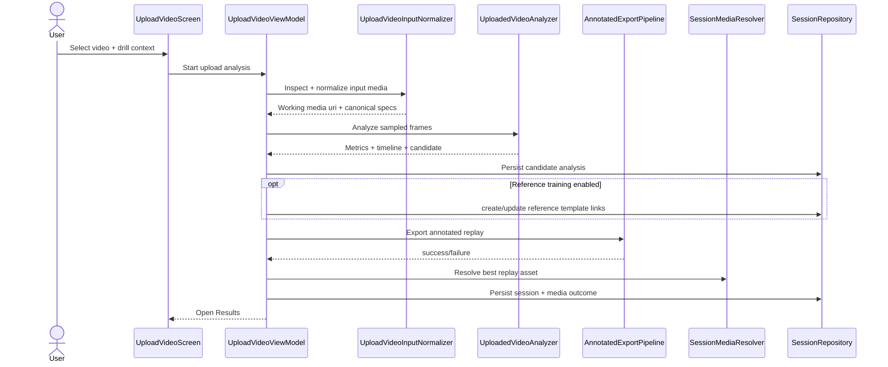

# Sequence: Upload / Analysis Flow

```mermaid
sequenceDiagram
    actor User
    participant UI as UploadVideoScreen
    participant VM as UploadVideoViewModel
    participant Normalize as UploadVideoInputNormalizer
    participant Analyzer as UploadedVideoAnalyzer
    participant Export as AnnotatedExportPipeline
    participant Resolver as SessionMediaResolver
    participant Repo as SessionRepository

    User->>UI: Select video + drill context
    UI->>VM: Start upload analysis
    VM->>Normalize: Inspect + normalize input media
    Normalize-->>VM: Working media uri + canonical specs
    VM->>Analyzer: Analyze sampled frames
    Analyzer-->>VM: Metrics + timeline + candidate
    VM->>Repo: Persist candidate analysis

    opt Reference training enabled
      VM->>Repo: create/update reference template links
    end

    VM->>Export: Export annotated replay
    Export-->>VM: success/failure
    VM->>Resolver: Resolve best replay asset
    VM->>Repo: Persist session + media outcome
    VM-->>UI: Open Results
```
