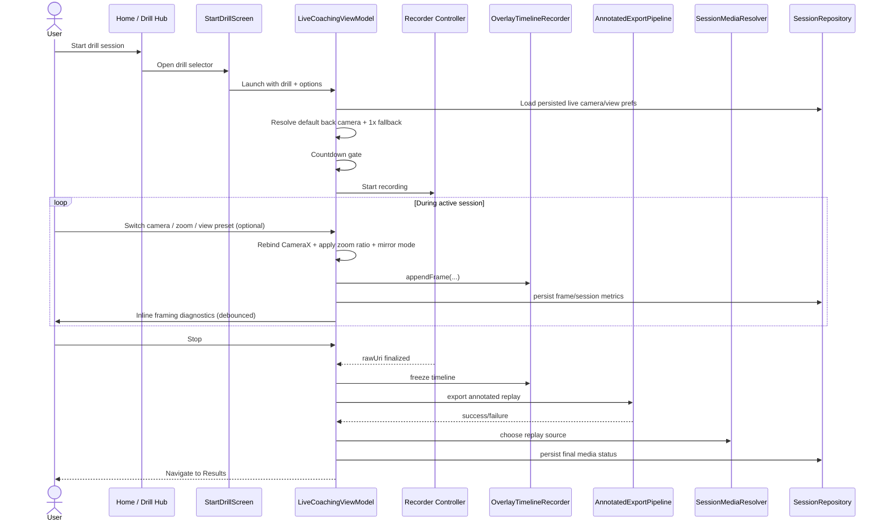

# Sequence: Live Session Flow

```mermaid
sequenceDiagram
    actor User
    participant Home as Home / Drill Hub
    participant Start as StartDrillScreen
    participant LiveVM as LiveCoachingViewModel
    participant Recorder as Recorder Controller
    participant Timeline as OverlayTimelineRecorder
    participant Export as AnnotatedExportPipeline
    participant Resolver as SessionMediaResolver
    participant Repo as SessionRepository

    User->>Home: Start drill session
    Home->>Start: Open drill selector
    Start->>LiveVM: Launch with drill + options
    LiveVM->>Repo: Load persisted live camera/view prefs
    LiveVM->>LiveVM: Resolve default back camera + 1x fallback
    LiveVM->>LiveVM: Countdown gate
    LiveVM->>Recorder: Start recording

    loop During active session
      User->>LiveVM: Switch camera / zoom / view preset (optional)
      LiveVM->>LiveVM: Rebind CameraX + apply zoom ratio + mirror mode
      LiveVM->>Timeline: appendFrame(...)
      LiveVM->>Repo: persist frame/session metrics
      LiveVM->>User: Inline framing diagnostics (debounced)
    end

    User->>LiveVM: Stop
    Recorder-->>LiveVM: rawUri finalized
    LiveVM->>Timeline: freeze timeline
    LiveVM->>Export: export annotated replay
    Export-->>LiveVM: success/failure
    LiveVM->>Resolver: choose replay source
    LiveVM->>Repo: persist final media status
    LiveVM-->>User: Navigate to Results
```
