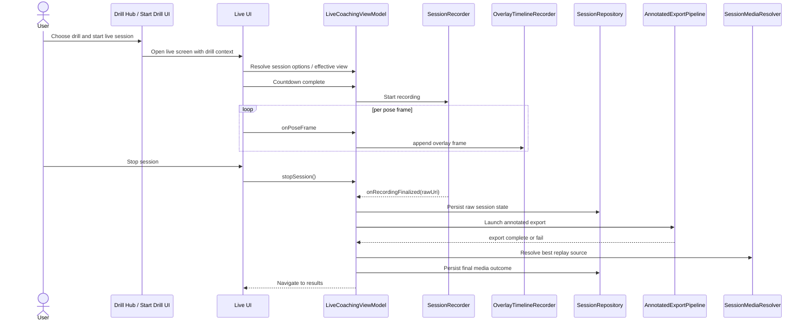

# Sequence: Live Coaching Session

```mermaid
sequenceDiagram
    actor User
    participant HUB as Drill Hub / Start Drill UI
    participant UI as Live UI
    participant VM as LiveCoachingViewModel
    participant REC as SessionRecorder
    participant OC as OverlayTimelineRecorder
    participant REPO as SessionRepository
    participant EXP as AnnotatedExportPipeline
    participant RES as SessionMediaResolver

    User->>HUB: Choose drill and start live session
    HUB->>UI: Open live screen with drill context
    UI->>VM: Resolve session options / effective view
    UI->>VM: Countdown complete
    VM->>REC: Start recording
    loop per pose frame
      UI->>VM: onPoseFrame
      VM->>OC: append overlay frame
    end
    User->>UI: Stop session
    UI->>VM: stopSession()
    REC-->>VM: onRecordingFinalized(rawUri)
    VM->>REPO: Persist raw session state
    VM->>EXP: Launch annotated export
    EXP-->>VM: export complete or fail
    VM->>RES: Resolve best replay source
    VM->>REPO: Persist final media outcome
    VM-->>UI: Navigate to results
```
