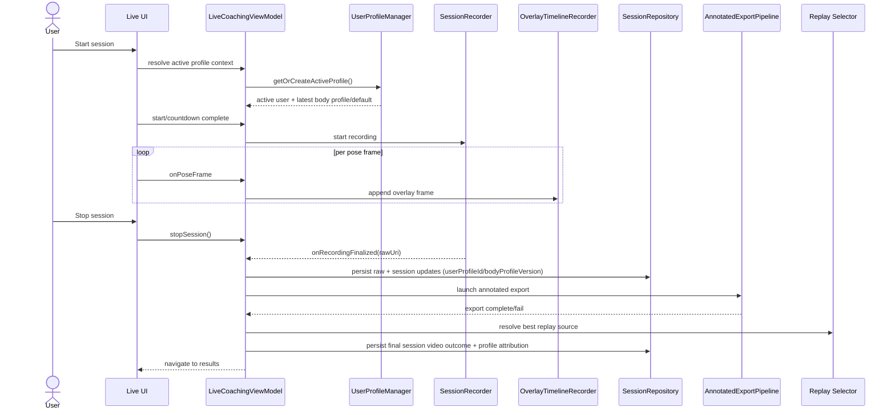

# Sequence: Live Coaching Session

```mermaid
sequenceDiagram
  actor User
  participant UI as Live UI
  participant VM as LiveCoachingViewModel
  participant UPM as UserProfileManager
  participant REC as SessionRecorder
  participant OC as OverlayTimelineRecorder
  participant REPO as SessionRepository
  participant EXP as AnnotatedExportPipeline
  participant SEL as Replay Selector

  User->>UI: Start session
  UI->>VM: resolve active profile context
  VM->>UPM: getOrCreateActiveProfile()
  UPM-->>VM: active user + latest body profile/default
  UI->>VM: start/countdown complete
  VM->>REC: start recording
  loop per pose frame
    UI->>VM: onPoseFrame
    VM->>OC: append overlay frame
  end
  User->>UI: Stop session
  UI->>VM: stopSession()
  REC-->>VM: onRecordingFinalized(rawUri)
  VM->>REPO: persist raw + session updates (userProfileId/bodyProfileVersion)
  VM->>EXP: launch annotated export
  EXP-->>VM: export complete/fail
  VM->>SEL: resolve best replay source
  VM->>REPO: persist final session video outcome + profile attribution
  VM-->>UI: navigate to results
```
