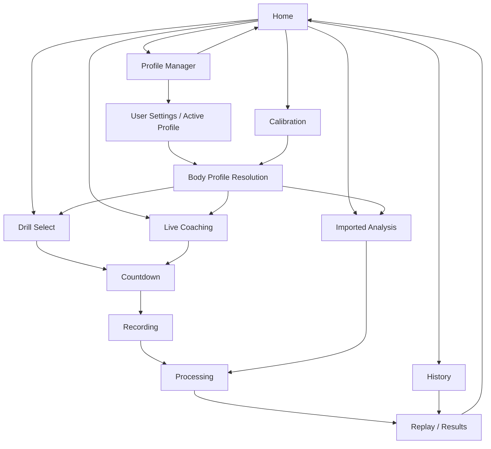

# UI Flow

```mermaid
flowchart TD
  H[Home]
  PM[Profile Manager]
  D[Drill Select]
  L[Live Coaching]
  C[Countdown]
  R[Recording]
  P[Processing]
  RS[Replay / Results]
  HI[History]
  U[Imported Analysis]
  CAL[Calibration]

  US[User Settings / Active Profile]
  BP[Body Profile Resolution]

  H --> PM
  H --> D
  H --> L
  H --> U
  H --> HI
  H --> CAL

  PM --> US
  US --> BP
  BP --> D
  BP --> L
  BP --> U

  D --> C
  L --> C
  C --> R
  R --> P
  P --> RS

  HI --> RS
  U --> P
  CAL --> BP
  RS --> H
  PM --> H
```
