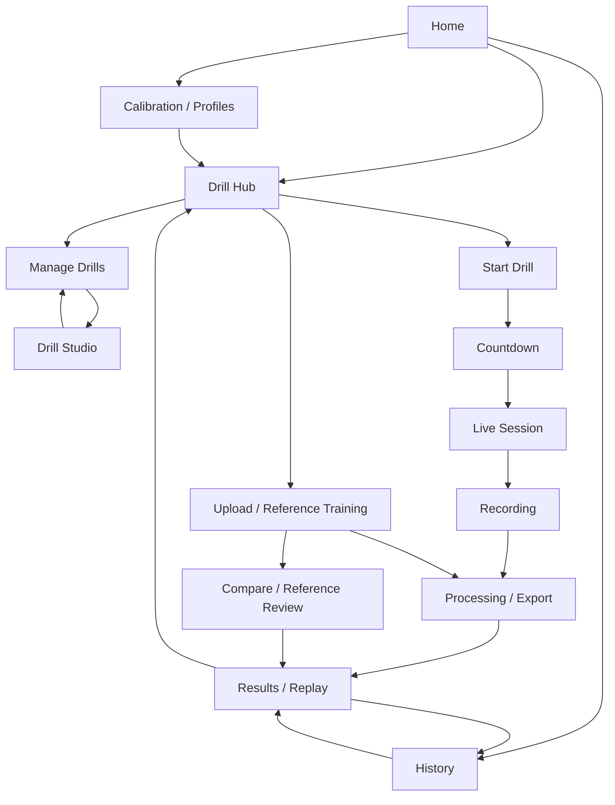

# UI Flow

```mermaid
flowchart TD
    H[Home]
    DH[Drill Hub]
    MD[Manage Drills]
    DS[Drill Studio]
    SD[Start Drill]
    L[Live Session]
    C[Countdown]
    R[Recording]
    P[Processing / Export]
    RS[Results / Replay]
    HI[History]
    U[Upload / Reference Training]
    CMP[Compare / Reference Review]
    CAL[Calibration / Profiles]

    H --> DH
    H --> HI
    H --> CAL
    DH --> SD
    DH --> MD
    DH --> U
    SD --> C
    C --> L
    L --> R
    R --> P
    P --> RS
    RS --> HI
    RS --> DH
    MD --> DS
    DS --> MD
    U --> P
    U --> CMP
    CMP --> RS
    CAL --> DH
    HI --> RS
```
