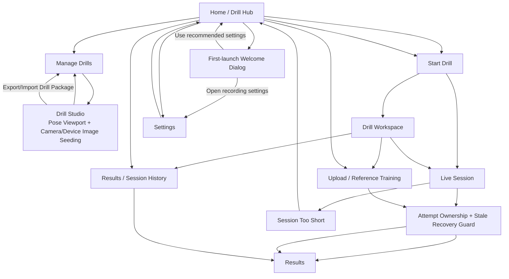

# Diagram: UI Workflow Overview

```mermaid
flowchart TD
    HOME[Home / Drill Hub]
    WELCOME[First-launch Welcome Dialog]
    START[Start Drill]
    LIVE[Live Session]
    OWNERSHIP[Attempt Ownership + Stale Recovery Guard]
    SHORT[Session Too Short]
    RESULTS[Results]
    HISTORY[Results / Session History]

    MANAGE[Manage Drills]
    STUDIO[Drill Studio\nPose Viewport + Camera/Device Image Seeding]
    WORKSPACE[Drill Workspace]

    UPLOAD[Upload / Reference Training]
    SETTINGS[Settings]

    HOME --> WELCOME
    WELCOME -->|Use recommended settings| HOME
    WELCOME -->|Open recording settings| SETTINGS

    HOME --> START --> LIVE
    LIVE --> OWNERSHIP --> RESULTS
    LIVE --> SHORT --> HOME

    HOME --> MANAGE --> STUDIO --> MANAGE
    STUDIO -->|Export/Import Drill Package| MANAGE
    HOME --> START --> WORKSPACE
    WORKSPACE --> LIVE
    WORKSPACE --> UPLOAD
    WORKSPACE --> HISTORY

    HOME --> UPLOAD --> OWNERSHIP --> RESULTS
    HOME --> HISTORY
    HISTORY --> RESULTS

    HOME --> SETTINGS --> HOME
```
