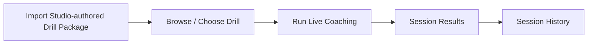
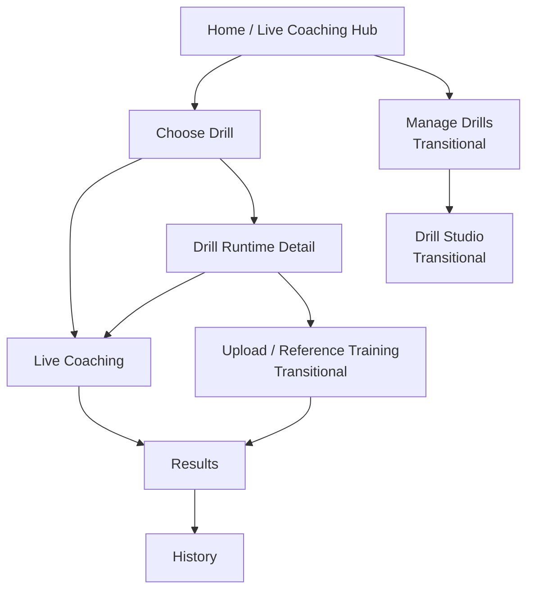

# Feature: Current User Flows (Android Runtime Focus)

This document captures current app workflows while clarifying the direction toward a Studio(web) + Android(runtime) split.

Studio repo: https://github.com/Voycepeh/CaliVision-Studio

## Ownership framing

- **Android primary ownership:** import drills, run live coaching on-device, review sessions/history.
- **Studio primary ownership (target):** full drill authoring + browser upload analysis/exchange.
- **Transition reality:** Android still contains upload and Drill Studio surfaces today.

## Route-level flow map

- `home` -> Home / Live Coaching Hub
- `start` -> Start Drill selector
- `drill-workspace/{drillId}` -> Drill Runtime Detail
- `live/...` -> Live Session
- `results/{sessionId}` -> Results
- `history` -> History Overview
- `session-history?...` -> Session History

### Transitional routes (present, de-emphasized)

- `manage-drills` -> Manage Drills
- `drill-studio?...` -> Drill Studio
- `upload-video?...` -> Upload / Reference Training

## Mobile runtime workflow (target primary)

## Current mixed-state workflow (today)

## User story after split

1. User creates/maintains drills in Studio web.
2. User imports package into Android.
3. User uses Android camera workflow for live coaching.
4. User reviews outcomes and history on mobile.
5. Heavy authoring + browser upload analysis happen in Studio.

## Migration guidance for existing users

- Existing Android upload/drill-authoring users can continue current flows during transition.
- New docs and UX language should steer users toward Studio for heavy authoring and upload analysis.
- Android should prioritize low-friction runtime actions: import, browse, run coaching, review.

## Maintenance rule

When route names, workflow boundaries, package behavior, or Studio/mobile ownership changes, update this file and related diagrams in the same PR.
